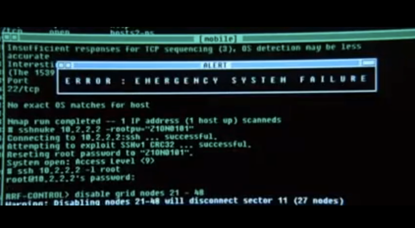

**Due: Tuesday, May 10, 2016 at 6:00PM**

## Assignment 5: Reading the Keyboard

In this assignment, you'll get a PS/2 keyboard working with your
Raspberry Pi.  This will let you type in commands and control the Pi
without needing to plug another computer into it. This is a longer
assignment: each part is simple, but there are many of them.

### Learning goals

In this assignment, you will

1.  Build on your scancode reader from Lab 5 to write a keyboard driver
    that correctly translates PS/2 scancodes into ASCII characters.
2.  Connect your keyboard driver to the serial port so that you
    see what you type.
3.  Write a simple shell that reads in commands and prints output.

### Assignment tasks

1.  **Pull the assignment 5 project.**

    To start the assignment, clone the `assign5` branch as you have done
    for previous assignments. You should
    see the starter code in your directory. You will be writing
    functions in `keyboard.c` and `shell.c`, but all test code should be written
    within `test.c`, so your `Makefile` should continue to build
    `main.bin` and `test.bin` as the outputs to load to the Pi.

    You can consult the header files
    [keyboard.h](https://github.com/cs107e/cs107e.github.io/blob/master/libpi/include/keyboard.h)
    and
    [shell.h](https://github.com/cs107e/cs107e.github.io/blob/master/libpi/include/shell.h)
    for more details about the interfaces you should fulfill.

    You will need to copy your gpio, timer, and printf modules into
    the code directory. You can alternatively rely on the reference
    implementations by adding them to LIBPI_REFERENCE_MODULES. You might
    want to start by implementing your assignment using the reference
    modules, then once your keyboard driver is working correctly, swap
    in your own modules and check that it still works and doesn't trigger
    a bug in your code.

    The tests in `test.c` do not actually do any functionality checking as in 
    previous assignments. The tests only print outputs from your various functions
    to the screen. It is up to you to verify that the outputs that are printed 
    are correct. Each test runs forever waiting for keyboard input, so you will
    have to run them one-by-one (commenting previous tests out) as you
    implement and test each function.

2.  **Process PS/2 scancodes.**

    Recall from lab that a PS/2 scancode is an 8-odd-1 packet
    consisting of 11 bits. The first bit, the start bit, is low. The next 8
    bits are data bits, least significant bit first. The tenth bit is a parity
    bit -- odd parity means that there should be an odd number of 1s in the
    data and parity bits. The 11th and final bit is the stop bit, which is
    always high.

    

    Copy in your implementation of `keyboard_read_scancode` from lab,
    then extend it so that it verifies the integrity of the parity bit
    and checks that the stop bit is correct. If either the parity bit
    or stop bit check fails, then retry reading a scancode byte.

    `keyboard_read_scancode` should not return 0 on such a check
    failure: instead, it should retry from the beginning. When it
    finally does return, it should return a valid scancode.

    The first test in `test.c` can be used to print out these scancodes.

    **Optional Extra**: In addition to protecting against corrupted bits,
    checking the stop and parity bits is a way to avoid incorrectly
    reading scan codes if your driver becomes desynchronized.  When
    this hapens, your driver can think a scancode byte starts in the middle
    of a packet from the PS/2 port rather than at the beginning. Use
    your timer code to detect if a falling clock edge occurs more than
    3ms after the previous one, and if so, reset the scancode reader and 
    assume this clock edge is for a start bit.  This behavior is not required, 
    but it's just a few lines of code, so doesn't count as an extension.

3.  **Handle key press vs. key release.**

    When you press a key, the PS/2 keyboard sends a scancode. When you release
    the same key, it also sends a scancode. This scancode is the same as the
    first one, except it is one byte longer: it has a leading `0xF0`. So typing
    `z` will cause the keyboard to send scancode `0x1A`. Releasing `z` will
    cause the keyboard to send scancode `0xF0 0x1A`. If you hold down z long
    enough the keyboard will send multiple press scancodes (auto-repeat).

    Implement `keyboard_read_event()` in `keyboard.c` so that it 
    returns events specifying whether a key was
    pressed or released. For example, if the scancode bytes received
    are `0x1A`, `0x1A`, `0xF0 0x1A` and `0x34`, the calls to
    `keyboard_read_event()` should return `down=1, code=0x1A`, `down=1,
    code=0x1A`, `down=0, code=0x1A` and `down=1, code=0x34`.

    This function should also ignore (reads and does nothing with) a
    value of `0xE0`. This code is used for some more advanced
    keys. Ignoring it means that you might see some funny behavior
    (e.g., pressing volume up will cause a `b` to be read), but that's
    OK. If you don't do this then pressing keys which have an `0xE0`,
    such as the right control key, will cause multiple characters to
    be read.

4.  **Process keyboard presses.**

    The next level of the keyboard driver returns key press events,
    including a bitmask of what modifier key (control, alt, shift)
    are currently pressed. For example, typing control-G will result
    in 4 key events (control down, g down, g up, control up), but
    only one press (g with modifier control).

    Implement `keyboard_read_press` in `keyboard.c`.
    Note that key press events should still return the scan code value.
    We have `#define`d a few scancodes in `libpi/include/ps2.h`.

5.  **Process ASCII characters.**

    You now have all of the pieces you need to return ASCII characters
    with `keyboard_read_char`. You'll need to apply shift and caps lock.
    If you're unsure how they interact, try with the test application from
    lab. It turns out that Windows/Linux handle it differently than
    a Macintosh. Your code should follow the Macintosh behavior, since
    it's better to rely on Apple for better user interface design.

    

    `ps2.h` has three arrays to help you: `is_char`, which specifies
    whether the scancode is for a character that `keyboard_read_char`
    might return, `char_from_scan`, which gives the ASCII character
    associated with a scancode, and `shift_char_from_scan`, which gives
    the ASCII character associated with a scancode when shifted up.
    For example `is_char[0x31]` is `1`, `char_from_scan[0x31]` is `n`, and
   `shift_char_from_scan[0x31]` is `N`.

    Finally, recall that going to the next line actually involves two
    separate ASCII codes. Newline, or `\n`, moves the cursor down one line.
    Carriage return, or `\r`, returns the cursor to the beginning of
    the line. Therefore, when someone types return/enter on the keyboard,
    your keyboard driver should return `\r` then `\n` the next time it
    is called.

6.  **Implement a simple shell.**

    At this point, you should be able to handle most characters typed
    at the keyboard. You'll now implement a simple shell which will
    allow you to type in and execute commands. You'll do this in
    `shell.c`. There are two functions, `shell_init` and `shell_run`.

    `shell_init` takes one parameter, which specify whether it should
    output to the serial port or screen.  For this assignment, you can
    ignore the output parameter and always have it output to the
    serial port.

    `shell_run` takes no parameters. It reads commands from the input,
    echoes them to the output, and prints output from commands to the
    output. To do so, you'll need to store the characters that are being
    typed into the input line by line.

    When Backspace is pressed (`\b`), the shell should delete the last
    character on the current line or do nothing if the line is
    empty. (Note that just printing `\b` to serial will only move the
    cursor backwards on `screen`.)

    When Enter is pressed, you should execute the command the user has
    typed in.

    Executing a command entails interpreting the line as a command,
    creating the inputs to the function corresponding to the command,
    and finally calling the function. `libpi/include/commands.h` has a
    three-field structure that represents commands. The `fn` field is
    a pointer to a function that takes two arguments: `argc`, the
    number of strings in `argv`, and `argv` a list of strings. It
    returns an `int` which should be `0` if the command executed
    successfully, or nonzero otherwise.

    There's a starter table of commands in `shell.c` called `commands`. You
    should modify this table as you add commands to your shell.

    You'll see that in the starter code for `shell.c` that
    `shell_printf` and `shell_putc` are function pointers that alias
    `printf` and `uart_putc`. You can keep them like this for now.
    You should call `shell_printf` and `shell_putc` whenever your code
    needs to call `printf` or `uart_putc`.

    (Later, in assignment 6, when you write code to draw on an HDMI monitor,
    you'll extend your shell to support the graphical screen. At that point,
    you'll change your `shell.c` code so that if `graphical=1`, the
    functions will be `console_printf` and `console_putc`.)

    When a user presses `enter`, you should process the current line as a
    command as follows:

    1. If the line is empty, simply print a new line.
    2. Otherwise, create an array of `char *` where each entry is one word in
       the line. "Words" are any characters separated by a space.
    3. Search the `commands` array for the command whose name
       is the first word on the line. If no matching command is found, print a
       short error message of your liking.
    4. Call the `fn` associated with the command, passing `argc`, the number of
       words (or arguments) in the line, including the first, and `argv`, an
       array of `char *`, i.e. an array of strings, with one element for each
       word in the line. There should be `argc` elements in `argv`.

    We've implemented the `echo` command for you. `echo` simply prints out all
    of its parameters. For instance, when a user types `echo Hello, world!` in
    the shell, the shell should print: `Hello, world!`. The session should
    look as follows once you've successfully implemented this tiny shell:

        echo Hello, world!
        Hello, world!

    _Note: This is very similiar to the way your shell (bash, zsh,
    etc.) works!_

    Because trying to debug the code that parses a line text into an
    array of strings is a bit harder on your Raspberry Pi than on your
    laptop, you might want to first write and debug it locally, or use
    the ARM simulator in gdb.

7.  **Utilities**

    Add the following commands to your shell:

    **help**

    Without any parameters, this should print a list of all available commands
    along with their description in the following format:

        help
        cmd1 - description
        cmd2 - description

    If a parameter is given, it should print the description for that command,
    or an error message if the command doesn't exist:

        help help
        [cmd] prints a list of commands or description of cmd

        help please
        error: 'please' is not a valid command

    **reboot**

    This command should reboot your Pi. It takes no parameters. We've included
    the `reboot` function in `libpi`. You can simply call `reboot()`.

    **peek**

    This command takes two parameters: `[address] <n>`. The first is a required
    address, and the second an optional number, `n`. It prints to the shell
    the `n` bytes, in hex, that are currently at address `address`. If `n` is
    not supplied, it prints a single byte.

    Example (assume 0xFFFF contains the number 0x12345678):

        peek 0xFFFF
        78

        peek 0xFFFF 4
        78 56 34 12

    Note the little endian storage. You should use `strtoul` to convert a numeric 
    string to a C integer. If you did the extension for `assign3`, you can use your 
    own `stroul`, or you may use the one we have provided in `libpi`. Check out the
    [strtoul man page](http://linux.die.net/man/3/strtoul) for more information 
    on its usage. You should also use `0` as the base. 
    You should use the `char **endptr` parameter to check if the passed in
    string was a valid number. 
    If a number is invalid, `peek` should print an error message.

    **poke**

    This command takes two parameters: `[address] [value]`. The first
    is a required address, and the second a required number. It sets
    the 4 bytes in memory at `address` to be the 32-bit `value`.

    Example (assume 0xFFFC contains the number 0x12345678):

        peek 0xFFFC 4
        78 56 34 12

        poke 0xFFFC 12345678

        peek 0xFFFC 4
        4e 61 bc 00

        poke 0xFFFC 0

        peek 0xFFFC 4
        00 00 00 00

    You should use `strtoul` to implement this command as well. Print an error
    message if either number is invalid.

    Once you've implemented `poke`, you should be able to turn a GPIO
    pin on and off just by entering commands!

        poke 0x20200010 0x200000

        poke 0x20200020 0x8000

        poke 0x2020002C 0x8000

    Recall the
    [BCM2835 manual](http://cs107e.github.io/readings/BCM2835-ARM-Peripherals.pdf#page=90)
    and what these 3 device registers do. What should each of these
    commands do, if `poke` works properly? Hint: the ACT LED on the Pi
    is GPIO pin 47. Another hint: see what the second value (the
    32-bit constant we want to store) looks like in binary in each case.

    Check out the
    [Wikipedia article on peek and poke](https://en.wikipedia.org/wiki/PEEK_and_POKE)
    if you're curious.

### Handing in

Commit and push your code to your repository. Then, create a pull request.

### Extension

This extension consists of two parts. You should do both parts.

1.  **History**

    Extend your command line so that pressing `up` changes the current line to
    display the command that ran prior to the one on the current line. Pressing
    down should change the current line to display the command that ran _after_
    the one on the current line, or whatever the user had typed until he/she
    pressed `up`. You should keep at least 5 lines of history, but you may
    choose to keep more.

2. **Tab Completion**

    Extend your command line so that pressing tab completes the command.
    If there are multiple matches (e.g., `p`), then sound a bell. The
    user can then type parameters. 
