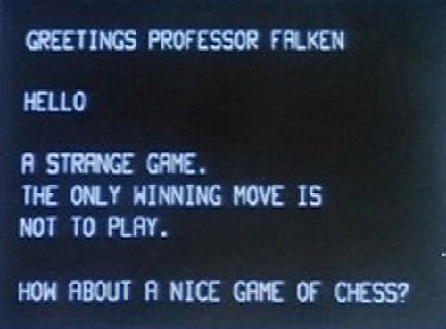

**Due: Tuesday, May 17, 2016 at 6:00PM**

A console is a text interface for entering commands and seeing output.
Today we have powerful shell programs that support scripts, process
control, and output redirection. But simpler consoles can be very
powerful too. One very famous console is
[Joshua in WarGames](https://www.youtube.com/watch?v=ecPeSmF_ikc).

### Learning goals

In these next two assignments, you will continue to take steps to
turning your Raspberry Pi into a working personal computer by writing a
console.

In the previous assignment, you wrote a keyboard driver so that you can 
type in characters from a keyboard and display them on the screen.  
After completing this assignment, you will be able to draw
strings of text on your screen.  We will use double-buffering so that
changes seem instantaneous without flickering or tearing. In the
final assignment, you will add interrupt processing, so you never miss
a character and the console code uses the processor much more
efficiently.

### Assignment tasks

1. __Pull the assignment 6 project.__

    To start the assignment, clone the `assign6` branch as you have
    done for previous assignments. You should see the starter code in
    your directory. You will be writing functions in various files for
    this assignment, but all test code should be written within
    `test.c`, so your `Makefile` should continue to build `main.bin`
    and `test.bin` as the outputs to load to the Pi.  If you would
    like to use our reference implementation for the keyboard, use
    `keyboard-blocking.o` rather than `keyboard.o`.

2. __Finish implementing the fb library.__  The functions in the framebuffer
    library are declared in `fb.h` and defined in `fb.c`. We have provided
    the code we showed in lecture (slightly modified) to initialize the
    framebuffer in the starter files. You will need to extend the library
    to include all the functions defined in `fb.h`.

    * `void fb_init(unsigned width, unsigned height, unsigned depth, unsigned doublebuffer)`:
    This function initializes a framebuffer with the given dimensions
    (`width`, `height`, `depth`). Make sure that the code works for
    different values of width and height. If `doublebuffer` is true,
    then double buffering is enabled; otherwise only a single buffer
    is created. If double buffering is enabled, you will need to create
    space for two buffers by setting the virtual height of the buffer
    to be twice the physical height.  Don't forget that the `pitch`
    (the length of a line represented in memory)
    in the framebuffer might be different than the `width` you specified.

    * `void fb_swap_buffer()`:
    This functions swaps the front and back buffer.  The front buffer
    should be displayed, and drawing should occur in the back buffer.
    A buffer swap involves changing the Y offset from 0 to the
    physical height (or vice versa). This must be done by writing the
    fb struct to the mailbox with the new `x_offset` and `y_offset`. You
    should do both a `mailbox_write` and a `mailbox_read`; if you leave
    off the `mailbox_read`, the system eventually hangs.

    * `unsigned char* fb_get_draw_buffer()`: 
    Returns a pointer to the memory storing the back buffer,
    the one being drawn into.

2. __Basic graphics library__.  The functions used
   by the graphics library are declared in `gl.h` and defined
   in `gl.c`.  You should implement the following functions:

    * `void gl_init(unsigned width, unsigned height, unsigned mode)`: 
      This function initializes the framebuffer to a
      given `width`, `height`, and number of buffers (`GL_SINGLEBUFFER`
      or `GL_DOUBLEBUFFER`).  Assume the graphics library always uses
      32-bit RGBA pixels.

    * `void gl_swap_buffer()`: This function swaps the front and back buffer.

    * `color gl_color(unsigned char r, unsigned char g, unsigned char b)`:
      This handy utility function returns a 32-bit value representing
      a pixel with the corresponding red, green, and blue
      values. alpha is set to `0xff`.  Note that `color` is defined as
      a type in `gl.h`.

    * `void gl_clear(color c)`:
      clear the entire framebuffer to color c.

    * `void gl_draw_pixel(int x, int y, color c)`:
      draw a single pixel at `x`,`y` with color `c`.  Note the
      implementation of `draw_pixel` used in lecture has to be
      generalized to work with any `width`.  Make sure that pixels are
      only drawn inside the rectangle defining the
      framebuffer. Also, remember that the `width` may differ from the
      `pitch`: you want to compute the location of the pixel in the
      framebuffer based on the pitch, not width, because the GPU may
      have made the pitch a little wider than the width.

    * `color gl_read_pixel(int x, int y)`:
      get the color of the pixel at `x, y` in the draw buffer.
      If you call `gl_draw_pixel` and then `gl_read_pixel` on the same `x, y`,
      you should get exactly the color you just drew there.

    * `void gl_draw_rect(int x, int y, int w, int h, color c)`:
      draw a solid rectangle starting at (x, y) and with size (w, h)
      with color `c`.  Again, make sure that pixels are only drawn
      inside the framebuffer.

3.  __Add text drawing to the graphics library__.

    We have also included `font.c`, which
    provides 32-bit (RGBA) images of standard ASCII characters. The
    character images are stored as one contiguous image in memory. The
    first character is !, whose ASCII value is 33
    (0x21). The last character is '~' (tilde), whose ASCII value is
    127 (0x7e). The characters are a fixed-width font, so finding the
    X offset in the image involves subtracting 33 from the value and
    multiplying it by the character width. The underlying image was
    generated by using GIMP (the open source Photoshop), typing in the
    characters, and choosing a C file as the output format. Since space
    has no pixels set, to minimize the size of the image
    it is handled in a special case.

    You should have read the source to `font.h` and `font.c` during lab.

    * `void gl_draw_char(int x, int y, char ch, color c)`:
      This function draws a single character `ch` with its top left
      corner at `x`, `y`. It should check that the character does not
      march off the right edge or bottom edge of the display (there
      should be no wrap-around or memory corruption).
   
    * `void gl_draw_string(int x, int y, char* str, color c)`:
      This function draws a the null-terminated string `str`
      with its top left corner at x,y. 

4.  __Console__

    Next, write a console application that acts like a terminal.  The
    console will implement two functions, `console_putc` and
    `console_printf`, which take the same arguments are `uart_putc` and
    `uart_printf`. This functions will let your programs print text on
    the terminal.

    The console should contain a buffer of characters that holds all
    the NROWS containing a line of text with NCOLS characters. If you
    change the characters in the console buffer, the screen should be
    automatically updated to display the text in the buffer.

    The console should also keep track of the current cursor position.
    When you print a character to the console, you should add it to
    the buffer at the current cursor position, increment the current
    cursor position, and refresh the display.  If you print past the
    end of a line, you should automatically wrap around to the next
    line of text.  As you wrap around on the last line of text (the
    one displayed on the bottom), you should scroll the text.  That
    is, you should shift all the lines up by one.  The top line should
    disappear and the bottom line should contain the new text.

    When processing characters, interpret the following special characters:

    * `'\n'`: move to the next line

    * `'\r'`: return to the beginning of the line

    * `'\b'`: back space (deletes last character)

    * `'\f'`: form feed, clear the console and set the cursor at the home position

    Rather than try to write this entire functionality in one go, break it
    up into pieces. For example, start by properly handling a single line
    console, which adds characters and processes the control characters
    above. Once you're able to handle a single line of text correctly,
    then think about how you want to represent multiple lines of text.
    Walk through (through notes, or just in your head) how you'll
    handle newline and scrolling with your approach. Some ways of representing
    text will make this much easier than others. We encourage you to talk
    with your fellow students to discuss the best data structure to use.
    Don't feel bound to one design: if you start implementing your
    approach and it starts seeming very difficult, with many hard edge cases,
    it might be you want to consider a new design.

    You should implement your console with two files, `console.h` and
    `console.c`.  The console code is a layer on top of the graphics
    library (which is a layer on top of the framebuffer library). This
    means that the console should handle all calls to `gl` or `fb`
    functions. A user should be able to call `console_init` and then
    `console_printf` and have characters print to the display (without
    making any calls to `gl` or `fb` functions).  We have given you
    `console.h`, which contains declarations for the following
    functions which you should implement.

    * `void console_init(unsigned nrows, unsigned ncols)` - Initialize the
    console with a character buffer that stores `nrows` of text
    each containing `ncols` characters. You should use the
    memory allocater you wrote in the last assignment to allocate
    space for the character buffer. `console_init` should handle the 
    call to `gl_init`.

    * `void console_putc(unsigned ch)`:
    Put a single character into the console
    buffer. Implement the special processing of characters such as
    `'\n'`, `'\r'`, `'\b'`, and `'\f'`, as described above. This should
    internally handle all double buffer swapping.

    * `int console_printf(const char *format, ...)`:
    Print a formatted string to the
    console. You should use the function `vsnprintf` that you wrote
    previously. This should internally handle all double buffer swapping.

    * `char console_get_char(const unsigned row, unsigned col)`
    This small function simply returns the character currently at the
    given row and column in the console.

5. __Adapt your shell to use the display.__

    If you've implemented all the `console` functions correctly, you
    should be able to copy your `shell.c` and any other modules you need
    into your assignment folder. Then edit your `shell_init` function
    so that if `graphical = 1`, `shell_putc` and `shell_printf` are set to
    `console_putc` and `console_printf` instead of the serial versions.
    (Make sure your shell uses those shell functions throughout instead
    of calling `printf` directly.)

    Then run `make install` to test the `main.c`
    in the starter code, which runs your shell in graphical mode.
    You should get a graphical version of the shell you wrote in assignment 5!

    If the shell feels slow or drops keys as you're typing, don't worry. We'll fix
    that problem in the next assignment. Why might the graphical shell be slow
    to process keys?

## Extensions

Each of these counts as a separate extension. You can do neither, one, or both.

### Extension 1: Line and triangle drawing

Extend the graphics library so that you can draw anti-aliased lines and
triangles. Make sure to follow the function prototypes given in `gl.h`.

This extension requires you to learn about line drawing algorithms.
A good starting point is 
[Line Drawing Algorithm](https://en.wikipedia.org/wiki/Line_drawing_algorithm).

Your line drawing function should draw *anti-aliased* lines:

Your triangles should be solid, filled in with the specified color. The edges of
your triangles should also be anti-aliased.

Please note that pasting-and-modifying an implementation you find online
is a violation of the honor code. You are of course welcome to read pseudocode,
but you should not be reading C/C++/Java/C# code and definitely not 
copying and pasting.

### Extension 2: Fonts

The approach libpi takes for drawing fonts is inefficient. First,
`font.c` copies the bitmap out to a monochrome image buffer. Next,
your graphics library converts the monochrome image into the proper
color and draws it on the screen. This is two copies.

Design a clean way to avoid this double-copying by copying the structure
definition in font.c into gl.c (or, create a file that gl.c includes)
and directly using the bitmap to draw
characters.

Next, generate a second bitmap of a different fixed-width font
and add a `void gl_select_font(int font)` call in `gl.c` that lets you select which font to
use, where 0 is the default font and >=1 are alternate fonts.

Generating the bitmap structure will require a bit of work. The
top comment in `font.c` suggests one way to do this: generate a
fixed-width image of font text, save it as an RGBA image C file in GIMP, then write
a C program that includes this file and outputs a bitmap structure.

If you come up with a better way, let us know! But don't use a 32-bit
structure, it will make uploading your program take a very long time.
Be sure to pick a neat font!

