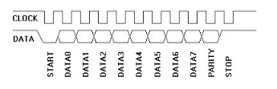

*Written by Philip Levis*

**Due: Tue, Mar 6, 2018 at 6:00 PM**

Your Raspberry Pi now reads and responds to your commands, thanks to all your hard work on the keyboard, shell, graphics, and console modules! In this final week, you'll add interrupts into your keyboard driver so that you can type as fast as the wind without dropping characters. Your transformation of the humble little Raspberry Pi into a standalone personal computer is now achieved. Reflect back on where you started and celebrate what an awesome journey you have completed! 👏👏

## Learning goals

In this assignment, you will

1.  Handle interrupts from your PS/2 keyboard and use them to read scancodes
    queued into a ring buffer.

2.  Modify your keyboard implementation to read scancodes from the ring
    buffer rather than directly from GPIO.

In addition, there is a third goal for those of you aiming for the complete system bonus:

+  Bundle the collection of modules you've written into a complete,
    self-contained library and show off your console running on your library.

The amount of new code you will write for this final assignment is much less than in previous weeks. This should give you a little extra bandwidth to revisit any of your previous modules that need attention in order to claim the complete system bonus. 

## Looking ahead

We also want you to start planning for your final project this week.  In particular, you will need to form your
team (1-3 people) and fill out a [Google
form](https://goo.gl/forms/wiYENPmq9zIxG8I13) with team member names by __11:59pm Monday March 5__ so we can set up your team repository on GitHub.

Next week we will devote the lab to a working meeting with your team. You and your teammates should attend the same lab next week. During lab you should refine your project ideas and come up with a specific project and plan.
After your lab you will need to submit a project proposal by __11:59pm Thursday March 8__. Details about what is expected in the final project and
what should be included in the project proposal may be found in the
  [project assignment writeup](/assignments/project). The project proposal will be submitted by pushing it to your team repo.

## Get started

First make sure your directory structure matches the layout detailed in [our guide](/guides/directory-structure).

Navigate to your copy of the `cs107e.github.io` repository and do a `git pull` on the courseware repo to be sure you have the latest versions of libpi modules and header files.

Now clone your `assign7` repository branch into the proper place within your directory structure.

Copy in your latest version of `keyboard.c` into your `assign7` directory. The keyboard module is the only module you need to edit for `assign7` itself.

If going for the complete system bonus, you should also copy in all of the .c files for the libpi modules you have previously written: `timer.c`,
`gpio.c`, `strings.c`, `printf.c`, `malloc.c`, `backtrace.c`, `keyboard.c`,
`shell.c`, `fb.c`, `gl.c`, and `console.c`. These modules will be compiled into a `libmypi.a` library.  

Use `make bonus` to verify that your version of `libmypi.a` builds properly and
can be successfully linked into a `main-bonus.bin` program. If you test  `main-bonus.bin` and the program works correctly, this validates your console is up and running and using all your code.

## Basic part

First, read over the code in the starter `test.c` and try it out with your existing keyboard driver. You should see that any keys typed while the test program is paused inside `timer_delay` will be missed. Employing interrupts to fix this is the focus of the final assignment.

### 1) Set up keyboard interrupts
You are going to modify how your keyboard driver reads PS/2 scancodes. Your current implementation of `keyboard_read_scancode` repeatedly polls the clock line until it sees the level transition from high to low. If your code doesn't happen to be watching at the essential moment, the event is lost. If you instead arrange for an interrupt to be generated by each falling edge, you can use the interrupt handler to immediately respond to the event by reading a data bit, never missing an event.

Change your `keyboard_init` function to configure an interrupt to be triggered on the falling edge of the clock line (GPIO pin 23). This code should look very similar to
the code you wrote in lab 7 to setup interrupts for each button press. Define an empty function `keyboard_handler` and attach it as the handler for the interrupt.

Implement `keyboard_handler` to first do something very simple as we did in lab, like incrementing a global variable that counts the number of interrupts received. Be sure that the handler clears the received event or the event will keep on triggering forever.  

Test this simple version of the handler by editing `main()` to enable global
interrupts and then go into a loop that prints the value of the global counter whenever it changes. Each scancode should generate a total of 11 interrupts, one for each bit: start bit followed by 8 data bits and the parity and stop bits. A typed key should send 3 scancodes (one for key down, two for key up) for a total of 33 interrupts. Use this as a test case to verify that your code correctly generates and receives interrupts.

Remember that when an interrupt handler is called, all other operations are on hold (including any other interrupts), so the handler needs to operate lean and mean. It should quickly process and clear the event so as to return control back to the main program without delay.

### 2) Gather a PS/2 scancode
Rather than just counting interrupts, `keyboard_handler` needs to respond to the falling clock event by reading a bit from the PS/2 data line. Because the handler reads a single bit at a time, you
will need to store the bits as they come until you've received a full byte. Review your existing bit-reading code in `keyboard_read_scancode` and work out how to move that code into `keyboard_handler` and re-formulate it to process one bit per interrupt. Be sure to retain the logic to synchronize on the start bit and verify the parity and stop bits.

When `keyboard_handler` receives the final bit of a valid transmission, write the scancode to a global variable and have your `main()` read and print that value so you can see the correct scancode has been assembled. Now is a good time to commit your code at this known good state.

(As a side note, the reference version of the keyboard module in libpi is capable of reading either by polling or by interrupts. Our module includes a function `keyboard_use_interrupts()`, which can be called to change the read mode. Your keyboard does not need to support this feature. You can directly re-purpose your previous code to read scancodes to instead read via interrupts without trying to preserve the old way of doing things.)

### 3) Use ring buffer
Almost there! To hand off the scancode that was read by `keyboard_handler` to the now-gutted `keyboard_read_scancode`, you will use the interrupt-safe ring buffer described in [lecture](https://cs107e.github.io/lectures/Interrupts2/Interrupts2.pdf). The header file `cs107e/include/ringbuffer.h` documents the behavior of each function and the source code is available in `cs107e/src/ringbuffer.c`. Carefully review the code and data structure to understand why it allows safe, concurrent access between the interrupt handler and the main program.

Declare and initialize a ring buffer in `keyboard.c`. Modify
`keyboard_handler` so that it enqueues the scancode  onto this ring buffer and have your `keyboard_read_scancode` function dequeue from the ring buffer. If the ring buffer is empty, `keyboard_read_scancode` should simply delay for a short duration and check again.

Now try typing on your keyboard. The `test.c` program should work as before, but also now be able to queue up keys even while paused.

Once you get this working, you should be able to run your shell program on the monitor just as in
assignment 6, except this time you should never miss a key.

You now have a fully operational console that uses interrupts!

## Complete system bonus
The `make bonus` target of the Makefile will take all of your modules and bundle them into a single library `libmypi.a` and then link the `main.c` console program against your `libmypi.a`.

If your `libmypi.a` uses only your own libpi modules for this assignment (no use of reference modules) and your interrupt-driven console works correctly, 
you will receive a full 10-point bonus. This is a big reward for a big 
accomplishment -- you have built the complete system yourself, from the ground up!

To be considered for the bonus, libmypi.a must use your own code
for all modules. We will not re-test all your modules to the extent that they were
tested when grading each assignment, but all shell commands should at
least work correctly. This means, for example, your printf must handle
printing padded hexadecimal numbers (which are needed for `peek`), but
need not necessarily handle negative values perfectly (since they are
not used in the full shell).

If you fulfill this bonus, you've successfully built a complete
computer system, and every line of code for that system is sitting in
your assign7 folder. Congratulations!

That `libmypi.a` is a complete library that packages up all your battle-tested code in a form ready to be incorporated into any future project.  Here is
[a sample, bare-bones project template](https://github.com/cs107e/cs107e.github.io/tree/master/_assignments/assign7/libmypi-usage)
which builds with libmypi.

To start a new project, copy those template files into a folder, copy
your `libmypi.a` in, and assign `CS107E` in the Makefile to your
CS107e folder to locate the library header files. Then you should be able to `make install` right
away and see that the `main()` in `main.c` runs and prints "Hello,
world!" You can program your Pi almost like an Arduino with this
high-level library you wrote.

## Extensions

On the off-chance that you still have extra energy after finishing the assignment and claiming your complete system bonus, we have two proposed extensions. You can do neither, one, or both.

### 1) Profiling

One extension is to add profiling support to your shell.
Profiling allows you to figure out 
where you program spends the most time executing.
The first thing you should do if you want to speed up your
program is to measure the program when it runs
and find out where it spends most of its time.
Speeding up those sections of the code will have the greatest
effect on the overall run time.

There is a very simple and clever way to do this.
First, you set the ARM timer to regularly interrupt your program.
Recall that when the interrupt handler is executed, 
it is passed the PC of the instruction that was about to execute.
An interrupt _samples_ your program periodically.
The probability that a given value of the PC is passed to the interrupt handler
is proportional to the time spent executing that instruction.
The more often that that instruction is executed,
the more times the interrupt handler will be called with that PC.
A profile is created by creating a histogram that counts
the number of times the program is interrupted at each PC.

For this extension, 
you add periodic timer interrupts, 
and write profiling code 
that creates a histogram of the PCs.
You will also add an new command to your shell to profile your program.

The header file `cs107e/include/gprof.h` declares the interface to the
profiling functions.

The profiling will maintain an array of counters, one for each instruction address in the text (code) segment.

There is a known address where the text segment starts (what value is
that again?), but to know the extent, you will need to edit the linker
map to mark the end.  It may help to revisit [lab4](_labs/lab4) for
information on linker maps.

Open the project file `memmap` and, patterning after
how symbols are used to mark the bounds of the bss section, add a symbol to identify
the end of the text section. Use this symbol in `gprof_init` to compute the
correct amount of space needed to have a counter for each instruction in the text segment.
All of those counters should be initialized to zero at the start of profiling.

`gprof_init` should configure a timer interrupt scheduled for the
interval defined in `gprof.c` using the libpi `armtimer` module.  (See
the header file
[armtimer.h](https://github.com/cs107e/cs107e.github.io/blob/master/cs107e/include/armtimer.h)).  Attach the function `gprof_handler` as an interrupt handler. `gprof_handler` takes one
argument, the value of the PC at the time of the interrupt, and will increment the counter for that value of the PC. Remember that all handler functions are called for all interrupts, so your handler should be sure to differentiate between GPIO and timer events so that it handles on the events it was intended to.

Add the command `profile [on | off | status | results]` to
your shell commands. `profile on` should initialize or zero-out all profile
counts and start profiling (enable timer interrupts). `profile off` should stop
the profiling (disable timer interrupts). `profile status` should print `Status:
on` or `Status: off`, depending on whether the profiler is on or off,
respectively. `profile results` should print current (if status is on) or most
recent (if status is off) counts to the debugger console using the `gprof_dump`
function. The `gprof_dump` should print the highest 10 counts to the console (in any order).

The final touch for your profiler is to provide the function name that each high-count instruction belongs to. If you remember back to the `backtrace` function from assignment 4, compiling `-mpoke-function-name` will embed each function's name as a string of characters before its first instruction. Thus if you walk backwards from a given instruction to look for the "magic" byte that marks the name, you can dig out the function's name from that location.

For each high-count instruction, you should report the address of the instruction, the function it belongs to, the instruction offset within the function, and the count of samples recorded for that instruction. Thus your profiler results look something like this:

    0x0000ae0c uart_putchar+36: 13358
    0x0000be1c timer_get_ticks+16: 23219
    0x0000be5c timer_delay_us+24: 36209

Cool, you now have a profiler!

### 2) PS/2 mouse and paint application

For this extension, you'll write a small paint application using your
`libmypi.a`.

Make a `paint` subdirectory in your assign7 directory. We've
provided one starter file, `mouse.c`, but you'll add files around it
so that the `paint` directory is actually a complete standalone
application, with its own `Makefile` and everything.

Copy the starter project files in
`cs107e.github.io/_assignments/assign7/libmypi-usage` into `paint`,
and copy your finished `libmypi.a` in as well. Edit the CS107E path in the
Makefile.

Make sure you can build and run the "Hello, world" application right
now.

Let's start implementing mouse support. Read these pages on the
[PS/2 protocol](http://www.computer-engineering.org/ps2protocol/) and
[PS/2 mouse specifically](http://www.computer-engineering.org/ps2mouse/)
for details on how to talk to a mouse.

Connect your mouse clock to GPIO pin 25 and mouse data to GPIO
pin 26. Add `mouse.o` to the `OBJECTS` in your Makefile.

Start by writing `mouse_read_scancode`. For now, just poll pins 25 and
26 to read the next scancode; it should be almost identical to your
old polling `keyboard_read_scancode`. You
might want to bring `wait_for_falling_clock_edge` over as a helper,
but make it wait on the mouse clock instead.

Next, implement `mouse_write`, the other half of the PS/2 protocol:
sending a byte from the Pi to the mouse. We need to tell the mouse to
set up before it'll send us anything. See "Host-to-Device
Communication" on the PS/2 protocol page for the full write
process. Here are some notes:

- You need to temporarily reconfigure the mouse's clock and data GPIO pins as output pins so you can pull them low
when needed. 'Release' (set as input again) the clock line after you
delay 100 us and write the start bit, and release the data line after
you write the parity bit and see a falling clock edge.

- Over the course of a write, you should wait for a falling clock edge
11 times (before sending each of 8 data bits, before sending the
parity bit, before releasing the data line, and before reading the
acknowledgment bit from the mouse). After that last falling clock
edge, spin until the data line goes high (that's the end of the ack
bit transmission).

Now carry out the mouse initialization sequence (as specified on the
PS/2 mouse page) in `mouse_init`:

1. Write a Reset scancode to the mouse to put it in Reset mode.
2. Read the ACK scancode from the mouse (should be 0xFA).
3. Read the BAT Successful scancode from the mouse (should be 0xAA).
4. Read the Device ID scancode from the mouse (should be 0x00).
5. Write the Enable Data Reporting scancode to the mouse.
6. Read the ACK scancode from the mouse (should be 0xFA).

Run `mouse_init` from `main.c` and confirm that the mouse is sending
you the scancodes you expect during this sequence. After calling
`mouse_init`, you should be able to read and print movement scancodes
from the mouse in a loop.

Next, let's use interrupts to read scancodes from the mouse instead of
polling.

Set your mouse clock GPIO to detect falling edge events and attach a `mouse_handler` function to handle the interrupt. `mouse_handler` reads a single bit per interrupt, gathers the bits until a full scancode is received and enqueues the scancode on the ring buffer. This function is a near-identical twin to your `keyboard_handler`, the only change being to read from the GPIO pins used for the mouse clock and data in place of those used for the keyboard.

Then make `mouse_read_scancode` pull a scancode out of the ring
buffer instead of polling. Make sure you can still read scancodes in a
loop.

Now implement the high-level `mouse_read_event` function on top, which
you will call from your paint program to read mouse-movement
events. See the `cs107e/include/mouse.h` file for more details on the
`mouse_event_t` structure, and consult the PS/2 mouse page to find how
scancode bits map to event details. Be careful about the 9-bit two's
complement representation of distances! Test this function with a loop
in `main.c`.

Now you can read mouse events! Finally, implement a paint application
in `main.c`: initialize the graphics library in single-buffer mode,
then loop, reading mouse events and drawing on the screen in response
to them.

It should be possible to:

- draw stuff [like a smiley face :-)] by holding down the left mouse
button and moving the mouse
- when not holding down the button, move some mouse pointer-like shape around on
the screen without disrupting stuff that's been painted

Other than that, the details of the UI are up to you. Describe in your
README how we should use your paint program!

## Submit

Commit your code to your repository and make a pull request.

Make sure you add all the necessary source files to Git so that we can
clone your assignment and build and run it. If you are aiming for the complete system bonus, double-check that all of your libpi source files are added and committed to the repository. If you are submitting the paint extension, be sure all of the needed files in your paint subdirectory are committed as well.

One means to verify what was included with your submission is to push and then clone it again from GitHub in a separate `assign7-clone` folder.  Build and run from this clone to be sure all essential files are present.

__Way to go! You have built your own computer system from the ground up!__
