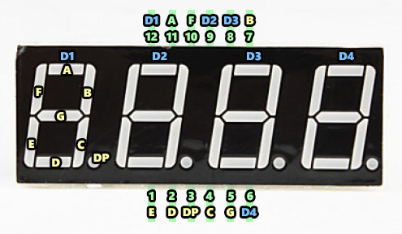
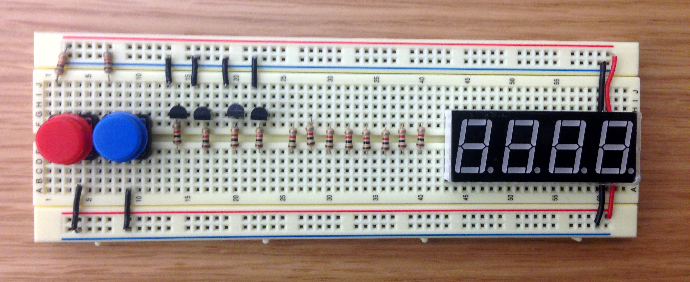

*Lab written by Pat Hanrahan*


Death Valley, CA.

### Goals

During this lab you will:

1 Understand the assembly language produced by ```gcc``` when compiling a C program.

2 Setup up a 4-digit 7-segment display 
for your next assignment - building a clock.

3 Understand basic ```Makefiles```

We have broken the lab into 3 sections. 

**To complete the lab, you must answer the questions in the
[checklist](checklist).**

### Prelab preparation

To prepare for this lab, you should do the following.

1 Read the [gcc](/guides/gcc) tutorial
about how to compile C programs for bare metal
programming on the Raspberry Pi.

2 Read the [make](/guides/make) guide
on setting up makefiles for cross-development
on the Pi.

3 Read section 2.1 in this writeup on the theory of operation
for 7-segment displays. Also, skim the rest of section 2.

To start this lab, find the `cs107e.github.io/_labs/lab2/code` directory.
You may need to pull from the `cs107e.github.io` repository
to get the latest code.
(Run `git pull` in your cloned `cs107e.github.io` folder from the previous lab.)

### Lab exercises

#### 1. Compiling C to assembly (30 min)

The goal of this exercise is to understand how C is translated 
into assembly language. You won't have much occasion to hand-code 
gobs of assembly, but you will do a lot of __reading__ assembly.

We want you to have an intuitive understanding of 
how the compiler generates assembly from C
and to be able to inspect that assembly to better understand 
what is happening when executing a program.
As we will see, sometimes the assembly language
produced by the C compiler can be surprising. 
Using your ARM superpowers, you can dig into the generated 
assembly and figure out what the compiler did rather than sit 
there dumbfounded when an executing program does not behave as expected!

##### Instructions

Change to the `codegen` directory. Review the C code in the `codegen.c`
and `ptrs.c` source files.

Whenever you want to see the ARM assembly code which the C compiler
generates from `codegen.c`, run `make codegen.list` in that folder,
then open `codegen.list` in your text editor. Similarly, if you want
to see the assembly generated from `ptrs.c`, run `make
ptrs.list`.

You'll probably want to run this once on the original C files, and
then again if you change the C code, so you can see how the generated
assembly changes.

##### Work

The code is decomposed into a number of functions, each of which explores 
a particular issue for code generation. You will have to wait until
Friday's lecture to hear about the operation of C function call/return, so 
for now, take it on faith that the first four parameters are placed
in r0, r1, r2, and r3, the return value is to be written to r0, and
the ARM instructions `bl` and `bx` direct control to/from a subroutine.

The comments in `codegen.c` guide you through four issues: (a) constant folding
(b) if/else versus switch (c) undefined behavior and ARM divide (d)
loops and loop unrolling and (e) more ARM divide.

In `ptrs.c` there are three parts: 
(a) dead code elimination (b) pointer/array access
and (c) pointer/bitwise expressions for access to GPIO.

During lab time, we'd like you to work through parts labeled (a), (c),
and (e) of codegen.c
and (a) and (b) of ptrs.c.  Use the comments in the C source as your guide.
You are encouraged to explore the remaining parts
in lab if you have time or leave for later completion on your own. 

Keep in mind that a great way to learn how a system works is by trying
things.

Curious or unsure what ARM is used for a given C construct? Type it up
and run it through the compiler (or through the online
[Compiler Explorer](https://gcc.godbolt.org/), though it gives
slightly different output) to find out!


#### 2. Setup up a 4-digit 7-segment display (75 min)

Your next assignment will be to build a simple clock
using a 4-digit 7-segment display.

This lab has been deliberately designed to step you 
through process and to *test as you go*.
We start simple,
test it to make sure you understand how the display works,
and then add more functionality.
For parts 2.2, and 2.3, feel free to use jumpers for ease of debugging!


#### 2.1 How it works

Let's start by understanding how a single 7-segment display works.

 

The 7-segment display, as its name implies,
is comprised of 7 individually lightable LEDs,
labeled A, B, C, D, E, F, and G.
There is also a decimal point labeled DP.
Each segment is an LED. 
Recall that an LED has an anode and a cathode.
The polarity matters for an LED;
the anode voltage must be positive relative to the
cathode for the LED to be lit.
If the cathode is positive with respect to the anode,
the segment is not lit.

On the 7-segment displays we are using,
the cathodes are all connected together.


Such a display is called a *common cathode* display.

To create a number, you need to turn on some of the segments.
What segments do you need to turn on to make a '1', a '0', an 'A"?

Here is a
[nice online simulation of a 7-segment display](http://www.uize.com/examples/seven-segment-display.html).

Your clock will display hours and minutes.
We will need 2 digits for the hour and 2 digits for the minutes,
for a total of 4 digits.
We will be using a display with 4 7-segment displays,
all integrated into a single unit.

[](images/display.jpg)

Here is a more detailed diagram of the package,

[](images/display.package.png)

and the schematic.

[](images/display.schematic.png)

Study these diagrams.
First, notice that there are 12 pins.
There are 4 digit pins,
labeled D1, D2, D3, and D4;
and 8 segment pins labeled A, B, C, D, E, F, G, DP.
Notice how the the pins are internally wired to the LEDs.
Each digit is an individual common cathode 7-segment display.
The segments (A-G) is wired to all 4 digits.
And the cathode for each digit has a separate pin.

Here is a handy photo of the display with the pins labeled.



The pins also have numbers.
The pin in the lower-left pin on the bottom is numbered 1,
and they increase as you move rightward up to 6,
and then continue around on the top.
Note that pin 12 is in the upper-left corner on the top.

#### 2.2. Wire up the resistors to the segment pins of the display

Let's wire up the segments of display and turn them on.

First, place the display on the right side of the breadboard.
Make sure the display is oriented correctly
(the decimal points should be on the bottom,
and the digits slanted to the right).
My convention when using a breadboard is to always place 
the blue ground rail on the bottom 
(after all, ground is alway underneath us).

**I placed my display so pin 1
is aligned with column 50 on the breadboard.**

That makes it easier to know which numbered hole 
is connected to a pin,
since after you insert the display into the breadboard 
you can't see the pins.

Second, place a single 1K resistor on the board.
Install the resistor so that it spans
the top and bottom vertical columns of 5 holes on the breadboard.

Hook up the power and ground rails of the breadboard
to the 3.3V and Ground pins on your Raspberry Pi.
Find three short male-male jumpers.
Wire the top of the resistor to the red power rail 
using an orange jumper (since orange indicates 3.3V),
and the bottom of the resistor to A (Pin 11) using a green jumper.
Then wire D1 (Pin 12) to Ground using a black jumper.
You may want to refer to the diagram above
that shows the pins of the display labeled.
When you apply power to your Raspberry Pi,
you should see the result shown below.


Now experiment.
After you light up segment A of digit 1,
light up segment B of digit 1.
Then rewire it so that you light up segment B of digit 2.
Finally, light up segment A and B of digit 1 **and** 2.
Note that you cannot simultaneously display 
different segments on different digits: Why?

Next, place 8 1K current limiting resistors 
in a row on your breadboard.
Let's always use the convention 
that the left-most resistor controls segment A,
and the right-most controls segment DP.
After you insert the resistors, test your circuit.
Apply power to various segments and create the pattern `"1 1 "`.
Here a space means that the digit is blank (no segments turned on).


Figure out how to display other numbers.

#### 2.3. Wire up the transistors to the digit pins

Up to now, you have been turning digits on and off
by grounding the digit pin.
We will eventually want to control which segments and digits 
are turned on using the Raspberry Pi GPIO pins,
so we need an electronic switch that can be controlled using these pins.
To do this we will use bipolar-junction transistors, or BJTs. 

A transistor has 3 terminals,
called the collector, emitter, and base.
The base controls 
the amount of current flowing from the collector to the emitter.
Normally the tranistor is open and no current flows from collector to emitter.
This condition is an open circuit.
However, if you apply 3.3V to the base, 
the collector will be connected to the emitter and current will flow.
This is equivalent to closing the switch.

We will be using 2N3904 transistors.
The following diagram identifies which
pins on the 2N3904 are collector, base, and emitter.


Note the the transistors have a flat side and a rounded side.
If you are looking at the flat side,
The left most leg will be the emitter (E).

When you wire up a BJT,
you need to use a current limiting resistor
between the base and the control voltage.
Now wire the collector of the left-most transistor to D1
(remember the collector is the right-most pin if the flat
side is facing you).
And apply power to the base of the transistor.
We should see the "1   " on the display.


#### 2.4. Permanently wire up the circuit

Now comes the time consuming part,
using 22AWG solid core wire,
connect the bottom of each resistor to the correct segment of the display.
Then wire the collector of each transistor to the digit on the display.
Be patient, this takes some time.
However, if it's taking you more than half an hour in lab, try moving on and coming back to part 2.

Here is a photo of what it should look like before wiring.


And here is what it should look like when it is wired up.


You will see some buttons in the photo. 
There is no need to add those buttons during lab.
The buttons are used for the extension to Assignment 2.


#### 2.5. Connect the display to the Raspberry Pi

The final step is to connect our display to the Raspberry Pi.
After we connect the Pi to the display, 
we can control the display with a program.
We will outline the process in the next few paragraph.s
However, there is no need to do this in lab.
You should be able to do this on your own outside of lab.

We will use GPIO pins 10-13 to control the 4 digits.
Pin 10 will control the first digit,
pin 11 will control the second digit, etc.
We will dedicate GPIO pins 20-27 to control 
the 8 segments on the display A-G and DP.
Pin 20 will control pin  A, pin 21 is B, etc.
In total, we will 12 GPIO pins on the Pi:
8 pins to control which segments are turned on,
and then 4 pins to control which digits are turned on.

To create a digit,
your program will set segment GPIO pins high 
to turn on the segments that you want to be lit up.
Your program  will also select 
which digit to display by turning on the transistor.
When you implement your clock,
you will write a program that will 
first display digit 0,
then it will turn off digit 0 and turn on digit 1, 
and so on.
Add some logic to keep track of time,
and you have a clock.

The extension challenges to provide a UI to the clock
that let's you set the time.
You are constrained to use only 2 buttons.
Here is how we wired up 2 buttons on our breadboard.



#### 3. Understand Makefiles (15 min)

Break into pairs and read the following Makefile.

```
    NAME = blink

    CFLAGS  = --std=c99 -Og
    CFLAGS += -ffreestanding -fnostartfiles -fnostdlib

    all: $(NAME).bin
     
    %.bin: %.o
        arm-none-eabi-objcopy $< -O binary $@

    %.o: %.c
        arm-none-eabi-gcc $(CFLAGS) -c $< -o $@
    
    %.list: %.o
        arm-none-eabi-objdump -d $< > $@

    install: $(NAME).bin
        rpi-install.py $<

    clean:
        rm -f *.o *.bin *.list
```

Discuss and document all the various features and syntactical constructs used
in this Makefile. You may use the 
[CS107 Guide to Makefiles](http://web.stanford.edu/class/cs107/guide_make.html) 
and the
[GNU Documentation about Compiler Options](https://gcc.gnu.org/onlinedocs/gcc-4.2.2/gcc/C-Dialect-Options.html)

 - What do each of the CFLAGS do?
 - What happens if you just type `make`? Which commands will execute?
 - If you modify blink.c and run `make` again, which commands will rerun?
What part of each target indicates the prerequisites? (A prerequisite means 
that if that file changes, then the target is stale and must be rebuilt)
 - What do the symbols `$<` and `$@` mean?

For more information about makefiles,
read the 
[CS107 Guide to Makefiles](http://web.stanford.edu/class/cs107/guide_make.html)

Now that you understand this simple Makefile, take a look at the one in the
`codegen` directory. That is an example of a more complete Makefile and is the
one we will work with and modify for labs and assignments in this class.
When you have time (now or later), go through that Makefile and ensure you
understand it as well.

### Later

After this lab, on your own time, you may try the following:

1. Go through parts (b) and (d) in codegen.c.

2. Walk through part (c) in ptrs.c.

3. Go through the codegen Makefile.
