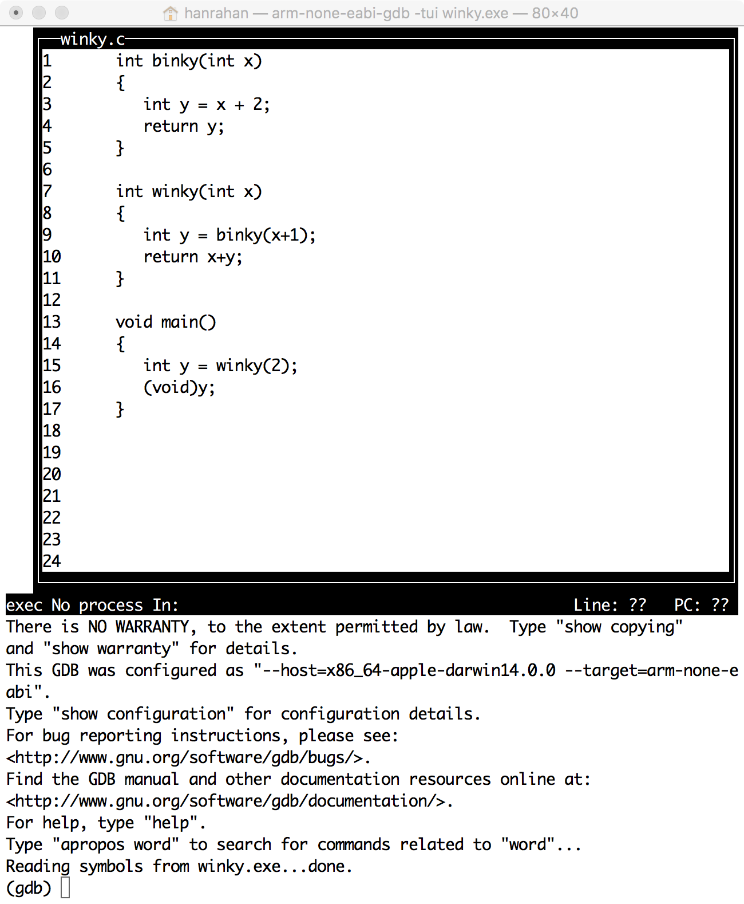
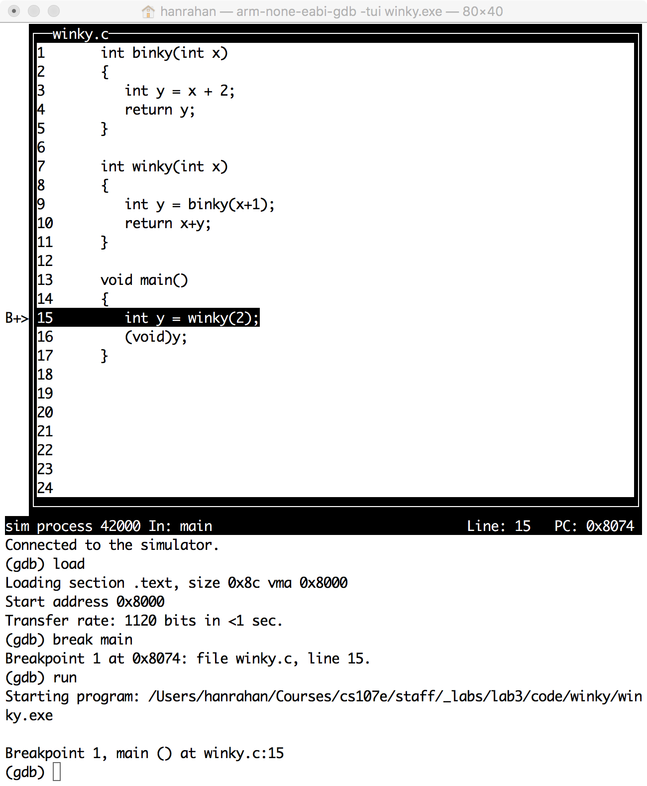
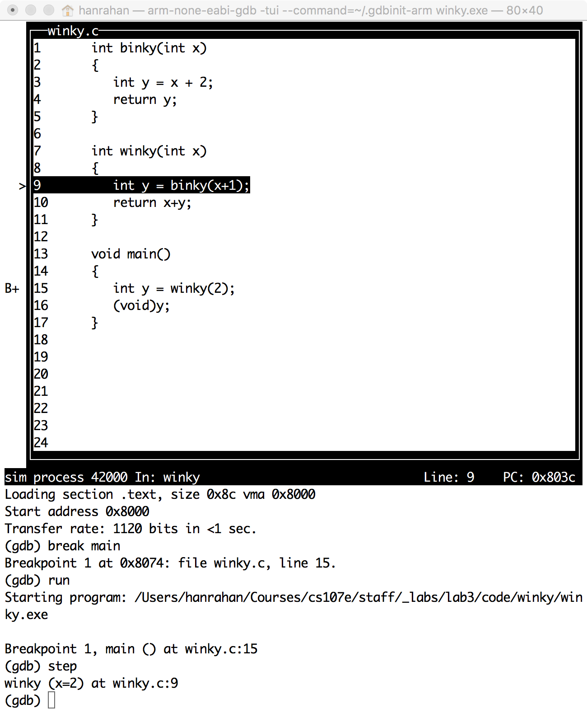
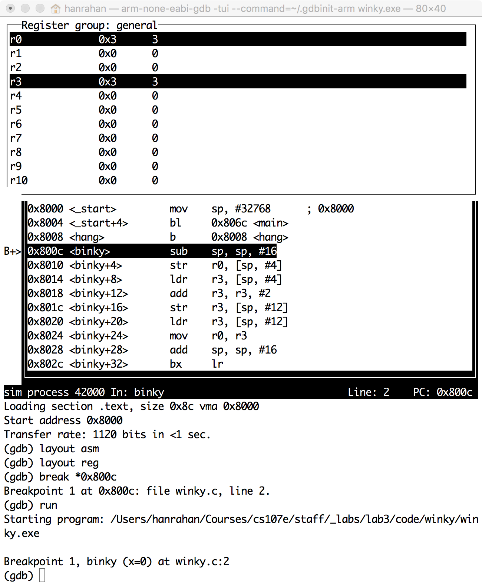
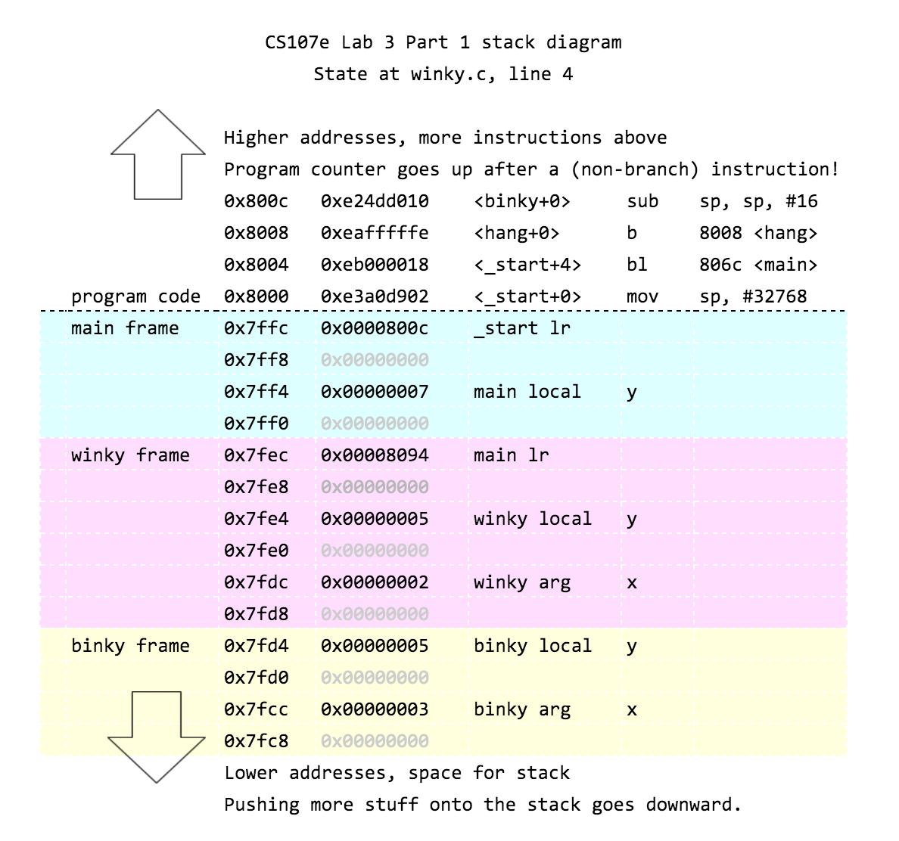
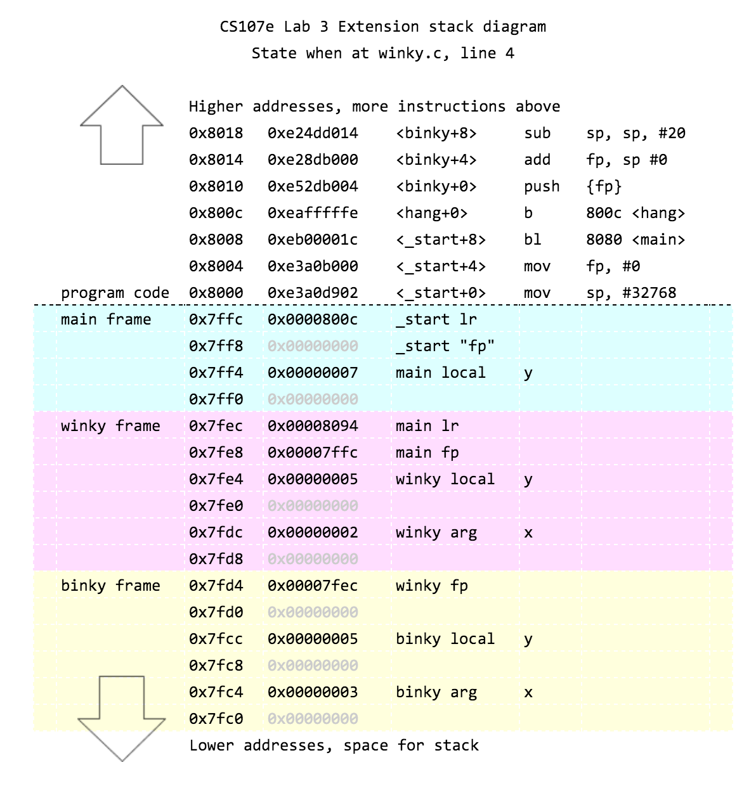

*Lab written by Pat Hanrahan*

### Goals

During this lab you will:

1. Learn how to debug using `arm-none-eabi-gdb` in simulation mode.
Simulation mode is also a good way to learn more about
how the ARM processor executes instructions.

2. Learn how to use `screen` with the USB-serial breakout board.
Also understand how the UART peripheral works on the Raspberry Pi.

To complete the lab, you must answer the questions in the
[checklist](checklist).

### Pre-lab preparation

To prepare for this lab, you should read the [gdb](/guides/gdb) tutorial.

### Lab exercises

#### Debugging with gdb

##### **Using `gdb` with C programs**

The goal of the first exercise 
is to practice using `gdb` in ARM simulation mode.
This is useful as a way of learning what happens
when ARM instructions are executed, and to debug programs.

We will begin by running `gdb` on the example `winky` from
the lecture on functions.
Change to the `cs107e.github.io/_labs/lab3/code/winky` directory.
Assemble and link the program using `make`:

    $ make
    arm-none-eabi-gcc -Wall -nostdlib -nostartfiles -ffreestanding -O0 -fomit-frame-pointer -g start.s winky.c -o winky.elf
    arm-none-eabi-objdump winky.elf -d > winky.list

Notice that in order to *debug* `winky`,
we needed to compile it with the `-g` option.

Now run `arm-none-eabi-gdb` on the executable. 

    $ arm-none-eabi-gdb -tui winky.elf
    ...
    (gdb) 

`tui` mode creates a split screen display.
On the top we see the source listing,
and on the bottom is the command window.

Start by putting `gdb` in simulation mode,
and then load `winky`.

    (gdb) target sim
    Connected to the simulator.
    (gdb) load
    Loading section .text, size 0x8c vma 0x8000
    Start address 0x8000
    Transfer rate: 1120 bits in <1 sec.

`gdb` allows us to control program execution.
Let's single step through the program.
Make sure you understand what each of the following commands does.

    (gdb) break main
    Breakpoint 1 at 0x8074: file winky.c, line 15.
    (gdb) run
    Starting program: ... lab3/code/winky/winky.elf
    Breakpoint 1, main () at winky.c:15

Note that line 15, the first line in `main`, is highlighted. 
`gdb` has run the program up to this point, and stopped,
because we have set a *breakpoint* at the start of `main`.

    (gdb) next
    (gdb) print y
    $1 = 7

When we typed the `next` command,
the next line in the program is executed. 
This line calls the function `winky`,
which returns the result and assigns it to `y`.
Is that the correct value for `y`? Why?

Sometimes you want to step through the function `winky` as well.
To do this, we rerun the program and use `step` instead of `next`.

    (gdb) run
    The program being debugged has been started already.
    Start it from the beginning? (y or n)  

Type `y` to rerun the program; it should hit the breakpoint.
Now type `step`.

    (gdb) step
    winky (x=2) at winky.c:9

Note that we are now stopped at the first line of `winky`.
Type the following.

    (gdb) print x
    $2 = 2
    (gdb) step
     binky (x=3) at winky.c:3
    (gdb) print x
    $3 = 3
    (gdb) step
    (gdb) print y
    $4 = 5
    (gdb) step
    (gdb) step
    (gdb) print y
    $5 = 5
    (gdb) step
    (gdb) step
    (gdb) print y
    $6 = 7

Does each printed value make sense with respect to the code that
you're paused at then? (Don't forget that if you're paused at a line,
you're paused *before* that line has executed.) I've done some steps
without looking at `y` here because `y` stays the same while you're
still stepping within those functions (and then changes when you get
out).

To exit `gdb`, type `quit`.

##### **Using gdb to understand assembly language and the stack**

Let's rerun `gdb`, but instead of showing the C source,
we will show the assembly language source,
as well as the current values in registers.

    $ arm-none-eabi-gdb -tui winky.elf
    (gdb) target sim
    (gdb) load
    (gdb) print binky
    $1 = {int (int)} 0x800c <binky>

Note that `binky` is not a variable,
but rather a function.
The value of `binky` is the address of the beginning of the function,
which is 0x800c.

We can print out the assembly language 
by disassembling the function `binky`.

    (gdb) disas binky
    Dump of assembler code for function binky:
       0x0000800c <+0>:     sub     sp, sp, #16
       0x00008010 <+4>:     str     r0, [sp, #4]
       0x00008014 <+8>:     ldr     r3, [sp, #4]
       0x00008018 <+12>:    add     r3, r3, #2
       0x0000801c <+16>:    str     r3, [sp, #12]
       0x00008020 <+20>:    ldr     r3, [sp, #12]
       0x00008024 <+24>:    mov     r0, r3
       0x00008028 <+28>:    add     sp, sp, #16
       0x0000802c <+32>:    bx      lr
    End of assembler dump.

Note that the first instruction of `binky` is at the
address `0x800c`, as we expect.

It is more convenient is to display the assembly language
in the source window. We can also display the registers.

    (gdb) layout asm
    (gdb) layout reg
    (gdb) break *0x800c
    (gdb) run

Note that if we want to stop at a particular address
we set a breakpoint at the address with a `*` preceeding it.

You should see the following.

Note that we are stopped at the first instruction of `binky`.
What value is in `r0`? Why does `r0` contain that value?

The register window shows all the register values.
We can also print a register.

    (gdb) print $sp
    $2 = (void *) 0x7fd8
    (gdb) stepi
    (gdb) print $sp
    $3 = (void *) 0x7fc8

Why is the value of `sp` less than `0x8000`?
The `stepi` command executes one assemble language instruction.
Note that the value of `sp` has decreased by 16
after the first few instructions in `binky`.

In this case, we're seeing that at the very start of `binky`, `$sp =
0x7fd8`, and then it's decreased by 16 after the `sub sp, sp, #16`
instruction, to make room for pushing some stuff onto the
stack. (Recall that the stack grows downward; the stack pointer
decreases as more stuff is pushed on.)

`gdb` has a very neat feature that you can always
print out (display) values every time you step.
This is done with the `display` command.

Let's display what's at the stack pointer in memory right now. If you
had a different `$sp` after the `sub sp, sp, #16`, use that
instead. This should be the smaller `$sp`, not the one from the start
of the function.

Here is a diagram of the state of memory right after `int y = x + 2;`
is run in the `binky` function.

Let's follow along with the execution by telling gdb to display some
of this memory as we go.

    (gdb) display /4xw 0x7fc8
    1: x/4xw 0x7fc8
    0x7c8:  0x00000000      0x00000000      0x00000000      0x00000000

This has the effect of displaying 4 words (w) going upward in memory,
beginning at address `0x7fc8`. If we care about the local stack frame
for this function, why didn't we decide to display `0x7fd8` (the
higher stack pointer from the beginning of `binky`)?

These 4 words are the 4 words on the interval of the stack between
`0x7fc8` (the stack pointer decreased by 16) and
`0x7fd8` (the stack pointer at the very beginning of `binky`).

The data is printed out in hexadecimal (x).
By using this `display` command,  
the values on `binky`'s stack are printed out as we step through 
the program.

    (gdb) stepi
    (gdb) [RETURN]
    (gdb) [RETURN]

Hitting just [RETURN],
causes `gdb` to repeat the last command (in this case `stepi`).

Watch how the stack changes as you step through the function.
Where on the stack is `x` stored, where is `y` stored?

Continue to play around with `gdb`.
It is a great way to learn ARM assembly language,
as well as track down bugs in your program.
It also lets you look at both the C and the assembly language source.

Answer the first question in the [checklist](checklist).

#### Serial communication

First, insert the USB serial breakout board into a USB port on your laptop.

Check whether it appears as a tty device
(remember, `tty` stands for teletype)

On a Mac:

    $ ls /dev/tty.SLAB_USBtoUART
    /dev/tty.SLAB_USBtoUART

On Linux:

    $ ls /dev/ttyUSB0
    /dev/ttyUSB0

You have been using the USB-serial breakout board 
to download programs to the Pi. 
To understand what is going on,
let's do a simple *loop back* test.

Remove the RX and TX jumpers between the USB-breakout board and 
from the header on the Pi.

Next, connect TX to RX directly on the USB-breakout board.

In loop back mode,
the signals sent out on the TX pin are wired straight to the RX pin.
This causes characters sent out to be echoed back.

We will use `screen` to send and receive characters over the tty port.
The command

    Mac:
    $ screen /dev/tty.SLAB_USBtoUART 115200

    Linux:
    $ screen /dev/ttyUSB0 115200

establishes a connection to the USB-serial breakout 
at the baud rate of 115200.

The screen should be cleared and the cursor positioned
in the upper left hand corner.
Type in some characters.  What happens?
What happens if you push return on your keyboard?

To exit screen, type `Ctrl-A` followed by `k`.
You should see the following message.

    Really kill this window? [y/n]

Typing `y` should return you to the shell.

    [screen is terminating]

##### **Test echo on the Raspberry Pi.**

Now, wire up the USB-serial breakout board to the Raspberry Pi.
Connect TX on the breakout board to RX on the Raspberry Pi.
Also connect RX on the breakout board to TX on the Raspberry Pi.

Change to the directory
`cs107e.github.io/_labs/lab3/code/echo`.
`make` the program in that directory,
and download it to the Pi.
Start up screen.
Characters should be echoed back the the terminal from the Pi.

##### **Test printing to your screen from the Raspberry Pi.**

Change to the directory
`cs107e.github.io/_labs/lab3/code/uart`.
The example in this directory show how to use `uart_putc`
to send characters using the TX pin on the Raspberry Pi.

    $ cd cs107e.github.io/_labs/lab3/code/uart
    $ ls
    Makefile    hello.c     start.s     uart.h      
    cstart.c    memap       uart.c

Download the `hello.bin` to the Raspberry Pi 
using the bootloader by running `make install`.

    $ make install
    ...

Power up the Raspberry Pi, and start `screen`.

    % screen /dev/tty.SLAB_USBtoUART 115200
    hello, laptop
    hello, laptop
    hello, laptop
    hello, laptop
    hello, laptop
    hello, laptop
    hello, laptop

This will print forever.
To stop it, exit `screen`; you can do this by holding 'Ctrl' and typing
`ad`; if you haven't reset the Pi you can also 
reattach later by using `screen -r`.

Read and understand the source to `hello.c`. 

##### **Using printf**

Change to the 
`cs107e.github.io/_labs/lab3/code/printf` 
directory.
Running the program in this diretory will
print "hello, laptop" using `printf`.
Assignment 3 will have you implement your own version of `printf`.

Now that your Pi can communicate with your computer, you can use the
`printf` we provide you in libpi.a to debug program state.

For example, you can call `printf("value: %d\r\n", 10);` 
to print the number 10 or `printf("value: %c\r\n", 'a');` 
to print the letter a. To

learn more about how to use printf, check out
[the documentation for it here](http://www.tutorialspoint.com/c_standard_library/c_function_printf.htm).

Open `hello.c` in your text editor.

Edit 'hello.c' to do the following three things.
Be sure you do these *after* the `uart_init()` call and initial delay, though,
so that you have time to start `screen` after running the program.

1. Use `printf` to print out the value in the `FSEL2` register in hex form. 

2. Use `gpio_set_function` to make pins 20 and 21 output pins.

3. Print out the value of `FSEL2` again.

Then restart your Pi, and run `make install`, and
use `screen` as before to see your program's output.
Recall that in order to see the value of each bit,
you have the convert the value
that was printed into binary.
Record the answer on the checklist.

#### Extension: The stack and the frame

_This section is optional._
If you do not have time to do it in lab,
you can do it outside the lab.
You should definitely do it before you start
Assignment 4 next week.

Change to the `cs107e.github.io/_labs/lab3/code/winky` directory
to start.

**STOP!** Before proceeding to
the contents of this section, go into the `Makefile` and replace
the CFLAG `-fomit-frame-pointer` to `-fno-omit-frame-pointer`.
Then, in `start.s` add in `mov fp, #0` on a new line after
`mov sp #0x8000`.

Now, the `Makefile` should look like the following:

    CFLAGS  = -Wall -nostdlib -nostartfiles -ffreestanding
    CFLAGS += -O0 -fno-omit-frame-pointer
    CFLAGS += -g

And the relevant chunk of `start.s` should look like:

    _start:
        mov sp, #0x8000
        mov fp, #0
        bl main

We will be playing with the frame pointer in this section;
and it wouldn't be fun if it didn't exist, now would it?

Now that we've taken care of that,
let's run `make` and then `gdb` on winky.elf.

    $ arm-none-eabi-gdb -tui winky.elf
    ...
    (gdb) target sim
    (gdb) load
    (gdb) break binky
    Breakpoint 1, binky (x=3) at winky.c:3
    (gdb) run

gdb should break where you set the breakpoint.
Now let's examine the backtrace.

    (gdb) backtrace
    #0  binky (x=3) at winky.c:3
    #1  0x00008060 in winky (x=2) at winky.c:9
    #2  0x00008094 in main () at winky.c:15

The backtrace shows that the function `binky` has
been called by winky from line 9,
which in turn was called by main from line 15.
The numbers on the left refer to the *frame*.
The current frame is numbered 0,
and corresponds to the invocation of function `binky`. 
Frames for caller functions
have higher numbers.

    (gdb) info frame
    Stack level 0, frame at 0x7fd8:
    pc = 0x8020 in binky (winky.c:3); saved pc = 0x8060
    called by frame at 0x7ff0
    source language c.
    Arglist at 0x7fd4, args: x=3
    Locals at 0x7fd4, Previous frame's sp is 0x7fd8
    Saved registers:
     r11 at 0x7fd4
    (gdb) info args
    x = 3
    (gdb) info locals
    y = 0

We can also inspect caller functions' locals.

    (gdb) up
    #1  0x00008060 in winky (x=2) at winky.c:9

This moves up to function #1,
which is the function `winky`. 
`winky` called `binky`.

    (gdb) info args
    x = 2
    (gdb) info locals
    y = 0

Now let's go back into the stack frame for `binky`.

    (gdb) down
    #0  binky (x=3) at winky.c:3

And disassembly the code for `binky`.

    (gdb) disas
    Dump of assembler code for function binky:
        0x00008010 <+0>:     push    {r11}           ; (str r11, [sp, #-4]!)
        0x00008014 <+4>:     add     r11, sp, #0
        0x00008018 <+8>:     sub     sp, sp, #20
        0x0000801c <+12>:    str     r0, [r11, #-16]
     => 0x00008020 <+16>:    ldr     r3, [r11, #-16]
        0x00008024 <+20>:    add     r3, r3, #2
        0x00008028 <+24>:    str     r3, [r11, #-8]
        0x0000802c <+28>:    ldr     r3, [r11, #-8]
        0x00008030 <+32>:    mov     r0, r3
        0x00008034 <+36>:    sub     sp, r11, #0
        0x00008038 <+40>:    pop     {r11}           ; (ldr r11, [sp], #4)
        0x0000803c <+44>:    bx      lr
    End of assembler dump.

This is the code that uses the `fp` discussed in the lecture on Functions.
Recall that the `fp` is stored in register `r11`.
Read this code carefully.
Make sure you understand where the arguments and local variables
of `binky` are stored on the stack.
Also make sure you understand the `sp` and `fp`
are set in the prologue and restored in the epilogue.

To do this, we recommend you start with the following commands and follow along on the
stack diagram we have provided to you below.

    $ arm-none-eabi-gdb -tui winky.elf
    ..
    (gdb) target sim
    (gdb) load
    (gdb) layout asm
    (gdb) layout reg
    (gdb) display /16wx 0x7fc0
    (gdb) break _start
    (gdb) run
    (gdb) stepi
    (gdb) [RETURN]

To check out for the extension section:
why might it be helpful to set `display /16wx 0x7fc0` when walking through the program?

To learn more about `layout`, check out this section in [an external GDB guide](https://beej.us/guide/bggdb/#regasm).

### Stack intuition

Functions often need space (e.g., for variables or to store the return
address of their caller before they call another function). There's
nothing special about this space, and we could allocate it as we
would any other memory.  However,
functions calls are frequent, so we want them as fast as possible.
Fortunately, we give
function calls two properties we can exploit for speed:

(1) when functions return, all allocated memory is considered dead

(2) functions return in LIFO order

As a result
of optimizing
for speed, people have converged on using a contiguous array of memory
(called *stack* because of its LIFO usage).  Roughly speaking it
works as follows:

1. At program start we allocate a fixed-sized stack and set a
pointer (the stack pointer) to its beginning at the lowest memory address.

2. At each function call, all the memory the function needs is
allocated contiguously and all-at-once by simply incrementing
the stack pointer.

3. At each function call return, all the memory the function
allocated is then freed all-at-once by simply decrementing
the stack pointer.

Operating systems generally provide ways to dynamically grow the stack, but we will
ignore this here.

This organization is such a clear winner that compilers have explicit
support for it (and do the pointer increment and decrement) and
architecture manuals provide the rules for how to do so.
(This basic data structure appears in many other contexts when all the
data for a given purpose or type can be freed all at once.)
If you know `malloc()` and `free()` one way to compare this method
and those functions is that the fastest malloc() you can do is a pointer
increment and the fastest free() a pointer decrement. 
