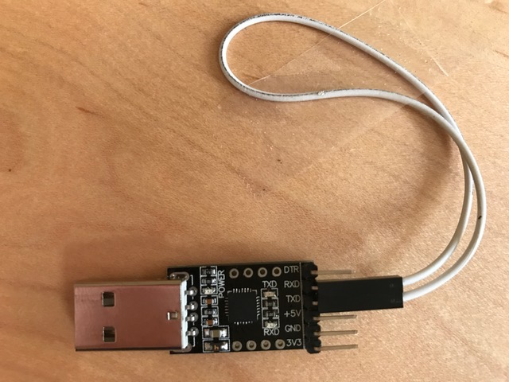

*Lab written by Pat Hanrahan*

### Goals

During this lab you will:

1. Learn how to debug using `arm-none-eabi-gdb` in simulation mode.
Simulation mode is also a good way to learn more about
how the ARM processor executes instructions.

2. Learn how to use `screen` with the USB-serial breakout board.
Also understand how the UART peripheral works on the Raspberry Pi.

3. Implement a few simple C-string operations and use a combination of
unit testing and gdb simulation to debug your work.

To complete the lab, you must answer the questions in the
[checklist](checklist).

### Pre-lab preparation

To prepare for this lab, you should read our [gdb](/guides/gdb) guide.

### Update bootloader on Pi and rpi-install.py on your computer

We've made an updated version of the bootloader which has a 'heartbeat' on
the green ACT LED, to let you know the Pi is waiting for you to send
it a program. This version of the bootloader also adds a brief pause 
after receiving the program and before starting it off so that the 
launched program won't interfere with the concluding handshake 
between the bootloader and rpi-install.

We've also made a new version of `rpi-install.py` that's smarter about
auto-detecting which serial port connects to the Pi. It also prints 
better error messages, and provides some new options to help you use 
the serial line on your Pi after loading your program.

1. Run `git pull` in the `cs107e.github.io` folder to get these new versions.

2. Copy the new `firmware/bootloader.bin` to `kernel.img` on your Pi's
   SD card.

3. If you're on a Mac, run `brew upgrade rpi-install` to upgrade your
   `rpi-install.py` to the newest version.

   If you're on Linux (including in the VM), run this command in your
   `cs107e.github.io` folder to replace your `rpi-install.py`:

   ```
   $ cp guides/mac_toolchain/rpi-install.py `which rpi-install.py`
   ```

Here's how to verify that you've now got the latest and greatest:

   - Re-start your Pi and observe that the green on-Pi LED repeatedly
     gives 2 short flashes ("da-dum"). This is the "heartbeat" that
     tells you the bootloader is ready and listening.

   - Run `rpi-install.py --help`. This prints the usage for the
     updated version. Take note of the new `-s` option -- what does
     the option do and why might this be handy?

If either of your versions fail to validate as the latest, double-check
you properly did the upgrade steps 1-2-3 above. Ask us if you need further help to resolve.

### Lab exercises

#### Debugging with `gdb`

##### **Using `gdb` with C programs**

The goal of the first exercise 
is to practice using `gdb` in ARM simulation mode.
This is useful as a way of learning what happens
when ARM instructions are executed, and to debug programs.

We will begin by running `gdb` on the example `winky` from
the lecture on functions.
Change to the `cs107e.github.io/_labs/lab3/code/winky` directory.
Assemble and link the program using `make`:

    $ make
    arm-none-eabi-gcc -I../../../../libpi/include -g -Wall -Og -std=c99 -ffreestanding  -c winky.c -o winky.o
    arm-none-eabi-as start.s -o start.o
    arm-none-eabi-gcc -I../../../../libpi/include -g -Wall -Og -std=c99 -ffreestanding  -c cstart.c -o cstart.o
    arm-none-eabi-gcc -nostdlib -T memmap winky.o start.o cstart.o -L../../../../libpi/lib -lpi -o winky.elf
    arm-none-eabi-objcopy winky.elf -O binary winky.bin

Notice that in order to *debug* `winky`,
we needed to compile it with the `-g` option.

Now run `arm-none-eabi-gdb` on the executable.  Note that is the ELF 
version `winky.elf` that we use in conjunction with the gdb simulator, 
not the raw `winky.bin` that we have been running on the actual Pi.

    $ arm-none-eabi-gdb winky.elf
    GNU gdb (GDB) 7.8.1
    ...
    (gdb) 


Start by putting `gdb` in simulation mode,
and then load the program.

    (gdb) target sim
    Connected to the simulator.
    (gdb) load
    Loading section .text, size 0xdc vma 0x8000
    Start address 0x8000
    Transfer rate: 1760 bits in <1 sec.

`gdb` allows us to control program execution.
Let's single step through the program. Follow along
with the sequence of commands below.

    (gdb) break main
    Breakpoint 1 at 0x80b8: file winky.c, line 16.
    (gdb) run
    Starting program: .../lab3/code/winky/winky.elf 
    Breakpoint 1, main () at winky.c:16

Note the last line in the snippet above. 
`gdb` has run the program up to line 16 and stopped,
because we have set a *breakpoint* at the start of `main`.

    (gdb) next
    18      winky(name);
    (gdb) next
    19  }
    (gdb) print name[1]
    $1 = 97 'a'

When we typed the `next` command,
the next line in the program is executed. 
This line calls the function `winky`.
We then use `print` to see the value of `name[1]`
after the call completes.

Sometimes you want to step into the function `winky`.
To do this, we use `step` instead of `next`.
Whereas `next` executes the next function call as one unit,
`step` will step into it. Use `run` to restart the program
and then use `step` to when you hit the breakpoint.

    (gdb) run
    The program being debugged has been started already.
    Start it from the beginning? (y or n)  y

    Breakpoint 1, main () at winky.c:16
    16  {
    (gdb) step
    18      winky(name);
    (gdb) step
    winky (str=str@entry=0x7ffffd8 "") at winky.c:10

We are now stopped at the first line of `winky`.
Print the value of `name[1]` before the assignment
statement, then step through that statement and
print the value of `name[1]` again. Does the value
change as you would expect? It is helpful to note 
that if you're paused at a line,
you're paused *before* that line has executed. 

To exit `gdb`, type `quit`.

##### **Using `gdb` to understand assembly language and the stack**

Let's rerun `gdb`, but instead of tracing the C source,
we will examine the assembly instructions, and keep an
eye on the current values in the registers.

    $ arm-none-eabi-gdb winky.elf
    (gdb) target sim
    (gdb) load
    (gdb) print binky
    $1 = {int (int)} 0x806c <binky>
    (gdb) break binky
    Breakpoint 1 at 0x806c: file winky.c, line 3.
    (gdb) run
    Breakpoint 1, binky (x=x@entry=9) at winky.c:3


Note that `binky` is not a variable,
but rather a function.
The value of `binky` is the address of the beginning of the function,
which is `0x806c`. We set a breakpoint on `binky` and then run the
program. When the breakpoint is hit, gdb stops the program just before 
executing the instruction at that address. 

We can print out the assembly language 
by disassembling the function `binky` using the command `disas binky`.
    
    (gdb) disas binky
    Dump of assembler code for function binky:
       0x0000806c <+0>: mov r12, sp
       0x00008070 <+4>: push    {r11, r12, lr, pc}
       0x00008074 <+8>: sub r11, r12, #4
       0x00008078 <+12>:    add r0, r0, #2
       0x0000807c <+16>:    sub sp, r11, #12
       0x00008080 <+20>:    ldm sp, {r11, sp, lr}
       0x00008084 <+24>:    bx  lr
    End of assembler dump.

Note that the first instruction of `binky` is at the
address `0x806c`, as we expect.

It is more convenient to display the assembly instructions
in the tui source pane. We can also display the registers.

    (gdb) layout asm
    (gdb) layout reg

You should see the following.


Note that we are stopped at the first instruction of `binky`.
What value is in `r0`? Why does `r0` contain that value?

The register window shows all the register values.
We can also print a register. Within gdb, we can access a
register by using the syntax $regname, e.g. `$r0`.

    (gdb) print $sp
    $2 = (void *) 0x7ffffc0
    (gdb) stepi
    (gdb) stepi
    (gdb) print $sp
    $3 = (void *) 0x7ffffb0

The `stepi` command executes one assembly language instruction.
Note that the value of `sp` has decreased by 16
after executing the first few instructions in `binky`.

In this case, we're seeing that at the very start of `binky`, `$sp =
0x7ffffc0`, and then it's decreased by 16 after the `push`
instruction that writes the four registers that form the APCS frame. 
(Recall that the stack grows downward; the stack pointer
decreases as more values are pushed.)

`gdb` has a very neat feature that you can always
print out (display) values every time you step.
This is done with the `display` command.

Let's display what's at the stack pointer in memory right now.

Here is a diagram of the state of memory right before `int y = x + 2;`
is run in the `binky` function.


Let's follow along with the execution by telling gdb to display some
of this memory as we go.

    (gdb) display /4xw $sp
    1: x/4xw $sp
    0x7ffffb0:      0x07ffffd4      0x07ffffc0      0x000080a8      0x00008078

This has the effect of displaying 4 words (w) going upward in memory,
beginning at address `0x7ffffb0`. These are the 4 values stored lastmost on the stack.

These 4 words are the content of the stack memory between
`0x7ffffb0 (the current stack pointer) and
`0x7ffffc0` (the stack pointer at the very beginning of `binky`).

The data is printed out in hexadecimal (x).
By using this `display` command,  
the values on `binky`'s stack are printed out as we step through 
the program.

    (gdb) stepi
    (gdb) [RETURN]
    (gdb) [RETURN]
    (gdb) [RETURN]

Hitting just [RETURN],
causes `gdb` to repeat the last command (in this case `stepi`).

Watch how the stack changes as you step through the function.
On which instructions does the value of the stack pointer change?

Re-run the program and wait for it to stop at your breakpoint on `binky`.
Use the gdb `backtrace` to show the sequence of function calls leading
to where we are:

    (gdb) backtrace
    #0  binky (x=x@entry=9) at winky.c:3
    #1  0x000080a8 in winky (str=str@entry=0x7ffffd8 "") at winky.c:11
    #2  0x000080d0 in main () at winky.c:18

The backtrace shows that the function `binky` has
been called by `winky` from line 11,
which in turn was called by `main` from line 18.
The numbers on the left refer to the *frame*.
The current frame is numbered 0,
and corresponds to the invocation of function `binky`. 
Frames for caller functions
have higher numbers.

    (gdb) info frame
    Stack level 0, frame at 0x7ffffc0:
    pc = 0x806c in binky (winky.c:3); saved pc = 0x80a8
    called by frame at 0x7ffffd8
    source language c.
    Arglist at 0x7ffffc0, args: x=x@entry=9
    Locals at 0x7ffffc0, Previous frame's sp is 0x7ffffc0
    (gdb) info args
    x = 9
    (gdb) info locals
    y = <optimized out>

`info locals` reports that `y` is optimized out, which is to say
that it did not need to use the stack to store its value.  Where,
then, is the value of `y` being tracked? (Hint: look at the generated
assembly instructions to figure it out!)

We can also inspect the state of our callers.

    (gdb) up
    #1  0x000080a8 in winky (str=str@entry=0x7ffffd8 "") at winky.c:11

This moves up to function #1,
which is the function `winky` which called `binky`.

    (gdb) info args
    str = 0x7ffffd8 ""
    (gdb) info locals
    z = <optimized out>

Now let's go back down the stack frame for `binky`.

    (gdb) down
    #0  binky (x=x@entry=9) at winky.c:3

Disassemble the code for `binky` and trace its operation instruction
by instruction.

    (gdb) disassemble binky
    Dump of assembler code for function binky:
       0x0000806c <+0>:     mov r12, sp
       0x00008070 <+4>:     push {r11, r12, lr, pc}
       0x00008074 <+8>:     sub r11, r12, #4
       0x00008078 <+12>:    add r0, r0, #2
       0x0000807c <+16>:    sub sp, r11, #12
       0x00008080 <+20>:    ldm sp, {r11, sp, lr}
       0x00008084 <+24>:    bx  lr
    End of assembler dump.

The first three instructions are the function _prolog_ which set up the
stack frame. Which four registers are pushed to the stack to set up the
APCS frame?  Where in the prolog is the frame pointer `fp` anchored?
What location in the stack does the `fp` point to?

The fourth instruction is the body of the `binky` function that does the
add operation. Where does `binky` read its argument from?  Where does `binky`
 write the return value of the function?

The fifth and sixth instructions are the function epilog. The epilog
is responsible for undoing the stack frame and restoring the
saved values for all caller-owned registers that were overwritten.

The final instruction is the branch exchange that returns control
to the caller. What is the address of the instruction in `winky`
that will be executed when `binky` returns?

Once you understand the instruction sequence in `binky`, 
examine the disassembly for `winky` and `main`. 
Identify what portions of the prolog and
epilog are common to all three functions and what portions differ.

Continue to play around with `gdb`.
It is a great way to learn ARM assembly language,
as well as track down bugs in your program.
It also lets you look at both the C and the assembly language source.

Answer the first question in the [checklist](checklist).

### Stack intuition

Functions often need space (e.g., for variables or to store the return
address of their caller before they call another function). There's
nothing special about this space, and we could allocate it as we
would any other memory.  However,
functions calls are frequent, so we want them as fast as possible.
Fortunately, we give
function calls two properties we can exploit for speed:

(1) when functions return, all allocated memory is considered dead

(2) functions return in LIFO order

As a result
of optimizing
for speed, people have converged on using a contiguous array of memory
(called *stack* because of its LIFO usage).  Roughly speaking it
works as follows:

1. At program start we allocate a fixed-sized stack and set a
pointer (the stack pointer) to its beginning at the lowest memory address.

2. At each function call, all the memory the function needs is
allocated contiguously and all-at-once by simply incrementing
the stack pointer.

3. At each function call return, all the memory the function
allocated is then freed all-at-once by simply decrementing
the stack pointer.

Operating systems generally provide ways to dynamically grow the stack, but we will
ignore this here.

This organization is such a clear winner that compilers have explicit
support for it (and do the pointer increment and decrement) and
architecture manuals provide the rules for how to do so.
(This basic data structure appears in many other contexts when all the
data for a given purpose or type can be freed all at once.)
If you know `malloc()` and `free()` one way to compare this method
and those functions is that the fastest malloc() you can do is a pointer
increment and the fastest free() a pointer decrement.

### Serial communication

First, insert the USB serial breakout board into a USB port on your laptop.

Verify that the board appears as a `tty` device
(remember, `tty` stands for teletype)

On a Mac:

    $ ls /dev/tty.SLAB_USBtoUART
    /dev/tty.SLAB_USBtoUART

On Linux:

    $ ls /dev/ttyUSB0
    /dev/ttyUSB0

You have been using the USB-serial breakout board 
to download programs to the Pi. 
To understand what is going on,
let's do a simple *loop back* test.

Remove the RX and TX jumpers between the USB-breakout board and 
from the header on the Pi.

Next, connect TX to RX directly on the USB-breakout board.

In loop back mode,
the signals sent out on the TX pin are wired straight to the RX pin.
This causes characters sent out to be echoed back.



We will use `screen` to send and receive characters over the tty port.
The command below establishes a connection to the USB-serial breakout 
at the baud rate of 115200.

    Mac:
    $ screen /dev/tty.SLAB_USBtoUART 115200

    Linux:
    $ screen /dev/ttyUSB0 115200

The screen should be cleared and the cursor positioned
in the upper left hand corner.
Type in some characters.  What happens?
What happens if you push return on your keyboard?

To exit screen, type `Ctrl-A` followed by `k`.
You should see the following message.

    Really kill this window? [y/n]

Typing `y` should return you to the shell.

    [screen is terminating]

##### **Test `echo` on the Raspberry Pi.**

Now, wire up the USB-serial breakout board to the Raspberry Pi.
Connect TX on the breakout board to RX on the Raspberry Pi.
Also connect RX on the breakout board to TX on the Raspberry Pi.

Change to the directory
`cs107e.github.io/_labs/lab3/code/echo`.
`make` the program in that directory and send to the Pi with
the command `rpi-install.py -s echo.bin`.  (Recall that 
invoking `rpi-install.py` with the `-s` flag will automatically
run `screen` after sending the program.) Any characters you now 
type should be echoed back to your terminal.

Unplug your loopback jumper from the RX port. What changed?

Use `Ctrl-A` `k` to exit `screen`.

##### **Test printing to your screen from the Raspberry Pi.**

Change to the directory
`cs107e.github.io/_labs/lab3/code/uart`.
The example in this directory show how to use `uart_putc`
to send characters using the TX pin on the Raspberry Pi. 

    $ cd cs107e.github.io/_labs/lab3/code/uart
    $ ls
    Makefile  cstart.c  hello.c   memmap    start.s   uart.c    uart.h

Read and understand the source to `hello.c`. Edit `Makefile` to 
change the recipe for the `install` target to
include the `-s` flag when invoking `rpi-install.py`.  Now you can
use `make install` to send the program to the Pi and start `screen`
in one go. 

    % make install
    Found serial port: /dev/cu.SLAB_USBtoUART
    Sending `hello.bin` (1128 bytes): .........
    Successfully sent!
    [screen starting will clear your terminal window here]
    hello, laptop
    hello, laptop
    hello, laptop
    hello, laptop
    hello, laptop
    hello, laptop
    hello, laptop

This will print forever until you reset the Pi. Use `Ctrl-A` `k` to exit `screen`.

##### **Using printf**

Change to the 
`cs107e.github.io/_labs/lab3/code/printf` 
directory.
Running the program in this directory will
print "hello, laptop" using `printf`.
Assignment 3 will have you implement your own version of `printf`.

Now that your Pi can communicate with your computer, you can use the
`printf` we provide you in `libpi.a` to debug program state.

For example, you can call `printf("value: %d\r\n", 10);` 
to print the number 10 or `printf("value: %c\r\n", 'a');` 
to print the letter a. To learn more about how to use printf, check out
[the documentation for it here](http://www.tutorialspoint.com/c_standard_library/c_function_printf.htm).

Open `hello.c` in your text editor and edit the `main` function to do the following three things.

1. Use `printf` to print out the value in the `FSEL2` register in hex form. 

2. Use `gpio_set_function` to make pins 20 and 21 output pins.

3. Print the value of `FSEL2` again.

Then restart your Pi, and run `make install` again to see your program's output.
Recall that in order to see the value of each bit,
you have the convert the value
that was printed into binary.
Record the answer on the checklist.

### C-strings
Change to the `cs107e.github.io/_labs/lab3/code/strings` directory 
and open the `strings.c` file in your editor. If you think it looks familiar, note
the striking similarity to the C-string program we saw in Monday's lecture.

We have implemented the `strlen` function for you! The code 
is simple enough that you might feel confident testing it "by inspection",
but let's use our unit testing strategy to make sure that
the function returns the correct result when actually executing.

The `main` function calls `test_strlen` to run some unit tests that 
validate that various calls to `strlen` return the correct 
result. Compile and run this program on the Pi and admire the green light
of success.

Now it's your turn to implement `strcpy`!

    char *strcpy(char *dst, const char *src)
    {
        // Your turn -- implement strcpy!
        return NULL;
    }

The function `strcpy` is supplied in the 
standard C library (for those spoiled programmers who work on hosted systems),
but you are going to implement it for your Pi. If you aren't sure of the 
function's interface, trying reading its man page:

    $ man strcpy

After you have working draft version of `strcpy`, uncomment the call 
to `test_strcpy` in `main`. 
Build and run on your Pi to see how your implementation fares on the
unit tests. If you get the red flash of doom, dig in to find 
out what's gone wrong and resolve the issue. Don't move on until you
earned the green badge of honor.

Now, let's run this same program under the debugger to get more
practice running gdb in simulation mode. You can make your 
job a little easier by first creating a `.gdbinit` configuration file
in the project directory that contains these four commands:

    target sim
    load
    b abort
    b main

This configuration file is read when you start gdb. The above commands
will set up the simulator and put breakpoints on `main()` and `abort()` 
(`abort` is called when a unit test fails).

Start gdb on the `strings`
program and use step/next/print and so on to trace through a run
of your program executing correctly.

Now edit your code to intentionally 
plant a bug, such as changing strlen to always return 5. Rebuild and run 
under the debugger to learn how a unit test failure will be observed.

When `abort` is called, it will valiantly set and clear the GPIO 
for the red on-Pi LED, but remember there is no Pi here and the simulator
does not emulate any of the peripheral behavior. Instead of fruitlessly 
looking for a sign from a non-existent LED, we will use a breakpoint 
on `abort` (as you did in `.gdbinit`) to be notified of a failed unit test.

At this point, both `strlen` and `strcpy` should work correctly for any
valid call. We are now going to do a little exploration into what happens 
for calls that are not so kosher. 

Review the code in the aptly-named `bogus_strlen_calls` function. 
Get together with your tablemates and analyze the three "bogus" calls.
For each consider __why__ it is invalid.

As a rule, the standard C-string
library functions don't offer much in the way of terms of error-reporting.
The reason for this is not of out of spite or laziness-- it's actually
not possible for `strlen` to reliably detect that its argument is
not a valid C-string. Given a bad call, the function is just 
going to blunder through its execution. With that fact in mind, 
for each of the three bogus calls, what will happen when you execute them?

Uncomment the call to `stress_test_strlen` in `main`, rebuild, and run the
program under gdb. Single step through the call to `bogus_strlen_calls`
and trace what value is returned from each of the bad calls.

Does what
you observe match what you thought would happen? Do you
understand the behavior you observe?  Continue through the
rest of the unit tests and you should see a failure on the second test.
But the second test is just a repeat of the first test! How is it even
possible that the first time the unit test passed, yet repeating
the same test failed? The only thing that was different was an unrelated
function call... or was that function truly unrelated after all? Poke
around in gdb, make observations, think about what is happening on the
stack, and talk it over with your partner.
Can you arrive at an understanding that explains what is happening?

Comment out the call to `stress_test_strlen`, uncomment the call to 
`stress_test_strcpy`, and rebuild.

Review the code for the `sketchy_strcpy_call` function. What exactly is
it doing that is questionable?

The `stress_test_strcpy` makes three
calls, two of which execute without harm, but that one in the middle is
bad news. Just as with `strlen`, `strcpy` has no means to detect or
report that the arguments it was given are invalid.  And whereas `strlen` 
was able carry on and silently blunder through __reading__ from an 
improper memory location, what is going to happen when `strcpy` starts
 __writing__ to one?  Have you and your partner draw a diagram on paper of
what is happening with the stack memory during this disastrous call.

Run under `gdb`
to trace through the execution. The sketchy call doesn't appear to
fail the unit test as the program won't hit the breakpoint set on
`abort`, but yet this test did fail and in a rather spectacular way.

This code exhibits a classic __buffer overflow__ bug where writing
too much data to a too-small stack buffer overwrites adjacent data
in the stack frame. What is the critical data stored in the stack that has
been destroyed here? At what point in the execution does the
overwritten data result in a bad consequence?

As a final C-string exercise, try your hand at implementing the 
function `atoi` to convert a string of digit characters to its 
numeric equivalent.

    int atoi(const char *str)
    {
        // Convert string of digits to numeric value
        // Your implementation here!
        return 0;
    }

It will help to note that the digits `'0'` through
`'9'` are in sequence in the ASCII character set and that you can add 
and subtract `char`s (they are effectively one-byte integers).

If you need a little inspiration to take on this task, 
take note that `atoi` is the stripped-down economy model of `strtol`, which
will make an appearance as an extension in the upcoming
assignment. Consider this a headstart on earning some of those bonus points!

### Check out with your checklist

Make sure you walk through the [checklist questions](checklist)
with a TA before you leave. The TA will ensure you are properly credited
for your work.