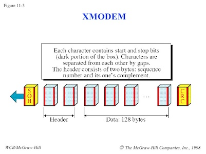

## Goals

During this lab you will:

1. Experiment with the linker `ld`, with the goal of understanding what is in
   an object (ELF) file, and how object files are combined to produce an
   executable.

2. Understand how executing programs are laid out in memory.

3. Read and understand the source to the bootloader. It is important to be able
   to read code produced in the wild.

4. Explore the stack and heap in preparation for assignment 4.

Note that this is one of the only labs that does not require use of your Pi.

To complete the lab, you must answer the questions in the [checklist](checklist). The last question involves writing a description of how
the bootloader works. See the detailed instructions in the third section of the
lab.

## Lab exercises

### Exercise 1: Linking

In the first part of this lab, you
will be repeating
some of live coding
demonstrations showed during lecture on linking and loading.
To start, check out the
[code](https://github.com/cs107e/cs107e.github.io/tree/master/_labs/lab4/code)
for this lab by changing to the `cs107e.github.io/_labs/lab4/code`
directory.

__Terminal Tip:__ You may find it helpful to create an alias for `arm-none-eabi-nm`, just as we
did in lecture! It can save your fingers from some extra typing if you like.

    $ alias nm=arm-none-eabi-nm

#### Symbols in Object Files

`cd` into the `linking` folder.

We will begin to examine the symbols 
(i.e.  function names, variables, constants, etc.)
in this program by typing:

    $ make clean
    $ make start.o
    $ arm-none-eabi-nm start.o

What does it print out? What is the purpose of `arm-none-eabi-nm`?
What do the single
letter symbols 'T', 'U', and 't' mean?
In another window, you may want
to open `start.s` in a text editor for comparison.

Here's [helpful documentation about `nm`](https://manned.org/arm-none-eabi-nm)
to get a better understanding.

*Do not continue until you and your partner(s) understand `nm`'s
output.*

Let's now try examining the symbols for this program.

    $ make linking.o
    $ arm-none-eabi-nm linking.o

What does this print-out tell you
about the variables and the functions in `linking.c`? 
(You may want to open `linking.c` in a text editor 
to see the source of `linking.o`.)
What do the single letter symbols 'D', 'R', 'C', and 'b' mean?
What do the numbers on the left mean?
Try to match each variable in `linking.c` with a symbol on the print-out.
Can you find them all?

Finally, let's see what `arm-none-eabi-nm` tells us about the symbols in
`cstart.o`.

    $ make cstart.o
    $ arm-none-eabi-nm cstart.o

#### Linking Object Files into Executables

During lecture, we went over how object files need to be linked together to form
one executable. `arm-none-eabi-ld` is the command that *links* the three files
together to form a single executable. Let's do this now.

    $ make
    arm-none-eabi-ld -nostdlib -T memmap linking.o start.o cstart.o -o linking.elf
    ...

Next, look at the symbols for the executable as you did before with `nm`.

    $ arm-none-eabi-nm linking.elf

What has happened during the link process?
Are there any undefined symbols?
What happened to the symbols marked 'C'?

What symbol do you think a `const int[10]` would be?
Uncomment line 10 in `linking.c` with `const int n_array[10];` and see for yourself!
And if you're still
curious, try experimenting a little to see how the type modifier `volatile`
(remember that?) changes which letters the symbols are matched with.

Finally, look at the assembly...

#### Executables!

Let's look at `start.list` to get a better idea of what happens during linking.

    $ make start.list
    $ more start.list
    ...
    00000000 <_start>:
       0:   e3a0d302        mov     sp, #134217728  ; 0x8000000
       4:   ebfffffe        bl      0 <_cstart>

    00000008 <hang>:
       8:   eafffffe        b       c <hang>

Note the branch at location 4.

The *branch and link* instruction `bl` branches to location 0.
Is 0 the address of `_cstart`?

Now let's look at the listing for `linking.elf`, 
and inspect the same code after linking.

    $ more linking.elf.list
    ...
    00008000 <_start>:          00008000 <_start>:
        8000: e3a0d302        mov     sp, #134217728  ; 0x8000000
        8004: e3a0b000        mov     fp, #0
        8008: eb000000        bl      8010 <_cstart>

    0000800c <hang>:
        800c: eafffffe        b       800c <hang>

    00008010 <_cstart>:
        8010: e92d4008        push    {r3, lr}
        8014: e59f3038        ldr     r3, [pc, #56]   ; 8054 <_cstart+0x44>
        8018: e59f2038        ldr     r2, [pc, #56]   ; 8058 <_cstart+0x48>
        801c: e3a01000        mov     r1, #0
    ...

What is the difference between the branch address in `start.o` 
before and after linking?
What did the linker do to change the address?
(Note: This is [checklist](checklist) question 2.)

_Again, don't move forward until you and
your partners understand the answers to these questions._

#### Combining Object Files into Libraries

Next, `cd` into `../libpi`.
This directory contains an example of building a library
`libpi.a` containing the files `gpio.o` and `timer.o`.

Read the `Makefile`.
Notice the lines

    libpi.a: $(OBJECTS)
    	arm-none-eabi-ar crf libpi.a $^

The `arm-none-eabi-ar` program forms an *archive* from a list of files.
The flags `crf` mean to create (`c`) the archive,
replace/insert (`r`) the files,
and use the filename (`f`) for the name of the archive.

Libraries can then be passed to the linker.

    $ make
    ...
    arm-none-eabi-ld -nostdlib -T memmap blink.o start.o cstart.o libpi.a -o blink.elf
    ...

The linker `ld` treats objects files (`.o`) and libraries (`.a`).
When linking object files, all the files are combined.
When linking libraries, only files containing definitions of
undefined symbols are added to the executable.
This makes it possible to make libraries with lots of useful modules,
and only include the ones that you actually use in the final executable.

### Exercise 2: The Memory Map

A crucial part of executing any program is memory management.
In order to get a sense of how memory gets organized through linking,
go back to the `code/linking` folder and run the following lines:

    $ make clean
    $ make
    $ more linking.elf.list

Look at the listing. How do the `.text`, `.data`, `.rodata`, and `.bss` sections
from the different files get combined during linking?

Now look at `memmap`.

- Do you see how the `memmap` linker script specifies how sections from
  individual files are to be combined?

- One of the purposes of `memmap` is to ensure that the global label `_start`
  appears first in the executable file. Why is it critical that this 
  function be first? How does `memmap` specify where `start.o`
  should be placed?

- Another purpose of `memmap` is to setup block storage of uninitialized
  variables. It does this by defining the addresses `__bss_start__` and
  `__bss_end__`. How are those addresses determined? In C, uninitialized
  variables should be set to 0. How does `_cstart` use those addresses to
  initialize the variables to 0?

- Try rearranging some sections of `memmap`! What happens to the organization of `linking.elf`
  if you swap the `.rodata` and `.data`
  sections? What happens if you put `c_start.o` after `start.o`?

By the way, `memmap` is actually a linker script! To learn more about twiddling with them,
here's some [helpful documentation](https://sourceware.org/binutils/docs-2.21/ld/Scripts.html).

### Exercise 3: The Bootloader

The third part of the lab involves reading and understanding how programs get
sent from your laptop to your Pi.

The code for this portion is in the folder
`bootloader`. Specifically, we will be reading the code for
the program that runs on the Pi, receives your program binary from your
computer, then starts it.

The bootloader we are using is a modified version of one written by 
David Welch, the person most
responsible for figuring out how to write bare metal programs on the Raspberry
Pi. If it wasn't for his work, we would not be offering this course.

The `bootloader.c` program is normally installed on your SD card as
`kernel.img`. When the Pi boots, it loads the bootloader code, and starts
running it. The bootloader program uses the Pi's UART to communicate with the
host (i.e. your laptop). What happens is the Pi receives the binary, loads it
into memory, and then branches to the code to begin execution.

#### Sending Programs

In order for your laptop to transmit the program binary to the Pi, we have been
using the program `rpi-install.py`. The laptop and the Pi communicate using a
simple file transfer protocol called XMODEM. In the jargon of XMODEM, the host
laptop is called the transmitter.

The transmitter first reads in the binary file it wants to send, and then sends 
the bytes to the Raspberry Pi as a series of packets. This is the algorithm
used in the transmitter.

1. Start the transmission by sending the SOH character, which has the value
   0x01. SOH is a *control character* which stands for *start of heading*;
   it indicates the start of transmission.

2. Next send the packet number as a byte. The first packet is numbered 1, and 
   the packet number is incremented after each packet is sent.

3. Next send a byte whose value is the complement of the packet number, or 
   `~packet_number`.

4. Send a 128 byte chunk of the binary file.

5. Finally, send a checksum byte.

6. Repeat the above for all the packets being transmitted. When there are no 
   more packets to be sent, send the EOT character; EOT stands for *end of 
   transmission*.

#### Receiving Programs on the Pi

You should be in the `cs107e.github.io/_labs/lab4/code/bootloader`
directory.

First, read the assembly language file `start.s`.
Note the `.space` directive between `_start` and the label `skip`.
This has the effect of placing the bootloader code
at location `0x200000`.
This creates a hole in memory
(between 0x8000 and 0x200000).
The bootloader loads your program into that hole.
Why can't the bootloader code also be placed at 0x8000?

Now let's look at the algorithm used to receive the XMODEM
protocol, as implemented in the file `bootloader.c`.
This program, which runs on the Raspberry Pi, is the receiver.

It reads bytes by doing the following:

1. **Wait for a SOH (start of heading) byte**

2. **Read the packet number**

   The first block must be packet number 1.
   The packet number of each packet should be incremented
   after each packet is successfully received.
   If the receiver sees a packet with the wrong packet number,
   the receiver should send the control character `NAK`, for
   negative acknowledge, to the transmitter.

3. **Check that the complement of the packet number is correct**

   How does the C code in bootloader check that the complement is correct?
   If the packet number and
   the complement of the packet number are not consistent,
   send a `NAK` to the transmitter.

4. **Read payload while updating checksum**

   Read the 128 bytes comprising the payload of the packet.
   Incrementally update the checksum when a byte arrives.
   The checksum is formed by adding together (mod 256) all the bytes in the packet.

   How is this done in the bootloader?
   Suppose we send 128 bytes,
   where the 1st byte is 1, the 2nd byte is 2, and so on, until
   we get to 128th byte which has the value 128.
   What is the value of the checksum in this case?

5. **Depending on checksum, send ACK or NAK**

   After all 128 bytes have been sent,
   read the checksum byte sent by the transmitter.
   Compare the checksum sent by the transmitter
   with the calculated checksum.
   If they agree, send an `ACK` (acknowledge) to the transmitter;
   if they do not agree, send a `NAK` (negative acknowledge) to the transmitter.

6. **Copy to memory**

   If the packet has been successfully received,
   copy it to memory,
   and prepare to receive the next packet.

7. **Check for EOT (end of transition) byte**

   If the receiver receives the EOT byte,
   then the transmission has ended.
   Send an `ACK`,
   and then jump to the program memory location.

Where does the bootloader copy the program?
What happens when the bootloader detects an error
which requires it to send a `NAK`?
How does it recover from errors?
Why does it use the timer?

Discuss the bootloader code in detail with your labmates.
Make sure you understand all of it.

Each group is responsible for
writing a description of the C implementation of the bootloader.
Break the description up into parts,
one for each person in your group.
Each person should write a paragraph
describing the part of the implementation assigned to them.
**Collate your descriptions, and hand in the completed writeup to the CA.**

Here is a helpful diagram as you look through the code.

### Exercise 4: The Stack and the Heap

`cd` into `code/strings` to begin your foray in allocating memory at runtime! 
The functions `malloc` and `free` become incredibly helpful when memory 
outside of the stack is needed; it's
also much more versatile than the `memmap` we explored above, 
which is specifically effective at dictating how large chunks
of memory ought to be used for a program.

Inspect the program `strings.c`. The `tokenize` function is used to 
dissect a string into a sequence of space-separated tokens. The function 
uses `malloc` (via `strndup`) to make heap copies of the token strings
to return to the caller.

Why can't `tokenize` declare space for
these strings in its stack frame?

The current version of `tokenize` stores the new strings into an array 
that is allocated by the caller and passed as an argument. 

Now, allocate this array in `tokenize` on behalf of the caller, fill it with 
pointers to dynamically-allocated tokens, and then return it. Make sure that `malloc` 
requests are expressed in number of __bytes__ to allocate.

How many 
bytes would you need for an array of `n` chars? What if the array
elements were `int` instead of `char`? 

Freeing memory when you are done with using it is the responsibility of 
the caller. Edit `main` to add the necessary calls to `free` 
to properly deallocate all of the dynamic memory it uses.

## Looking ahead to assign4

Having a solid understanding of the memory layout of your program is essential before starting
on your next assignment! We recommend you that you review the diagram for `winky` from lab3 as 
an example. We upgraded that diagram to show the text and data sections along with the stack to help 
you visualize the entire address space. [Check it out now!](https://cs107e.github.io/labs/lab3) Reviewing
the lab3 diagram will also help you answer one of today's [checklist questions](checklist).

And of course, make sure you walk through the [checklist questions](checklist)
with a TA before you leave. The TA will ensure you are properly credited
for your work.