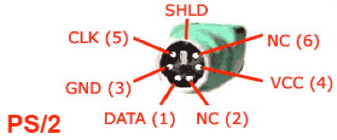

*Lab written by Philip Levis, updated by Pat Hanrahan*

### Learning goals
During this lab you will:

1. Install a PS/2 port onto your breadboard and plug it into your Raspberry Pi
1. Inspect the PS/2 protocol using a logic analyzer.
1. Test the keyboard to make sure it works with the Raspberry Pi.

In Assignment 5, you will read PS/2 scancodes from a keyboard and turn
them into ASCII characters.  This will allow you to type text that
your Raspberry Pi can process.  The goal of the lab is to setup the
keyboard so that you can immediately start on the assignment.

To complete the lab, you must complete the [check list](checklist.md).

### Lab exercises

To start this lab, pull from `cs107e.github.io` and go into
the directory `_labs/lab5`. 

#### 1 Add a PS/2 port to your Raspberry Pi (20 min)

Most modern keyboards are USB keyboards.  Unfortunately, the USB
protocol is much more complicated than the PS/2 protocol, and it is a
significant amount of work (approximately 2,000 lines of code) to
interface a USB keyboard to the Raspberry Pi.  Instead, we will
interface with a PS/2 keyboard which uses a simple serial protocol
that is easy to decode.  The PS/2 keyboard appeared on the original
IBM PC.

There are two common PS/2 devices: a keyboard and a mouse.  PS/2
devices connect to a PC using a 6-pin mini-din connector.  By
convention, the mouse uses a green connector and the keyboard uses a
purple connector.

Get a keyboard and a PS/2 port from a TA. Inspect the inside of the keyboard 
connector, you will see that it contains a plastic tab (that forces you to 
plug it in with the correct polarity) and 6 male pins.  Two pins are 
NC (not-connected), and the other carry VCC, GND, DATA and CLK.

Plug the PS/2 port into a free area of your breadboard. The PS/2 port
has 8 pins. You'll need to plug it into the center of your board, so
the pins from each side are on different sides of the board.

Look at the breadboard so the PS/2 port side with the green printed
circuit board is facing you.

The leftmost pin of the pins closer to you is the clock line.

The other three pins are on the pins further away from you. The
leftmost is power (5V), the second from left is ground, the third pin
is unused, and the last pin (rightmost) is data.

For the VCC and GND pins, add male-to-female jumpers.

For the CLK and DATA pins, add both male-to-female and male-to-male
jumpers. We'll use the male-to-female jumpers to connect the keyboard
to your Raspberry Pi, and the male-to-male jumpers to connect it to a
logic analyzer.

Use a red jumper for VCC, black for GND, yellow for DATA, and white
for CLK.

Your board should look something like this when done, with the
exception that you'll have two sets of jumpers for CLK and DATA.

Note that the spacing of the PS/2 port is such that to fit two data
lines we added a jumper to another row on the board, since
it was a bit hard to fit them both:

If you don't want to break out the data line in this way
or crowd the breadboard with too many wires, you can just
use one jumper, changing with male-to-male for the Saleae then moving
to male-to-female for your Raspberry Pi.

Plug the male-to-female GND and VCC jumpers into 5V and GND pins on
your Raspberry Pi.

#### 2 Use the Saleae Logic Analyzer to visualize the PS/2 protocol (30 min)

We will use the Saleae Logic Analyzer to examine the signals 
being sent by the keyboard. You can do this in groups of 2 or 3.

First, familiarize yourself with the logic analyzer.  It is contained
in a small, red or block anodized aluminum enclosure.  On one side is a USB
port, and on the other side are the jumpers. This logic analyzer can
simultaneously watch 4 or 8 channels, depending on which model it is.
Each channel has a pair of jumpers (one for signal, the other for
ground) so there are a total of 8 or 16 jumpers. In this lab, we be
watching the two channels DATA and CLK from the keyboard.

Second, download and install the *Logic* application from the Saleae
web site.  This application runs on Windows, Linux and Mac OS.

[Saleae Download](https://www.saleae.com/downloads)

You may also want to download the 
[user manual](http://downloads.saleae.com/Saleae+Users+Guide.pdf).

Launch the application; you should see a screen similar
to the following.

Third, connect the logic analyzer to the keyboard.  Connect the
male-to-male CLK jumper to channel 0 and the DATA line to channel
1. On the Saleae, the signal wire for channel 0 is colored black,
channel 1 is brown. The corresponding ground line for a channel is
directly underneath its signal wire.  Recall from lecture that you
need to ground each channel to the Raspberry Pi to complete the
circuit otherwise it can have erratic behavior. Just use ground
pins on your Raspberry Pi. Connect the Saleae
USB cable to the USB port of your computer.

This is what it looks like wired up. 

Fourth, configure the logic analyzer to acquire the signal.

Click the up/down arrow button to the right of the green "Start"
button to access the setup options. Use a sampling rate of at least 1
MS (megasample) per second and instruct it to record several seconds
of samples.  You may also want to set the trigger so that the logic
analyzer starts recording when the CLK signal (channel 0) is
falling. Configure a trigger for a channel by clicking the button
labeled with "+ wave".

Once you have the logic analyzer configured, push *Start* and
type on the keyboard. The logic analyzer should pop up a dialog
saying that it is capturing data.  After a few seconds it should
return and display the data it collected.  You can zoom in and out and
pan left and right to see the details of the captured signal. You
should see the characteristic pattern of the PS/2 protocol.

The Logic application supplies common analyzers that can be applied to
the captured data. Click the "+" button next to "Analyzers", choose
"Show more analyzers", and then select "PS/2 Keyboard/Mouse" from the
list.  Setup the analyzer so that the CLK is channel 0 and the DATA is
channel 1.  The captured data is now decoded according to the PS/2
protocol and it will display the hex values sent by the keyboard.

##### Questions

1. What frequency is the PS/2 clock running at?

2. What is the *make* code for the key `A`?

3. Which bit arrives first: the least significant or the most significant?

#### 3 Test the Keyboard and the Pi (20 min)

Next, disconnect the keyboard from the logic analyzer and connect it
to the Raspberry Pi.  Connect the white jumper (CLK) to GPIO23
and the yellow jumper (DATA) to GPIO24. 

As a reminder, here are the pin outs on the GPIO header.

Here is what it should look like if everything is connected
up properly.

At this point, you should have a keyboard connected to the Raspberry Pi.
Let's test it using the program showed in class.

    % cd code/keyboard_test
    % make
    % make install
    % screen /dev/tty.SLAB_USBtoUART 115200

Note that this program is a little different than how you're going to
implement your keyboard in the upcoming assignment (and in the last
part of the lab): it uses interrupts. Don't worry about this right
now. We'll cover them later in the course, and you'll update your code
to use them then.

Type different keys and you should see the scan codes printed
on your screen. If you don't see them, check your wiring.

As you saw with the Saleae, scan codes are not ASCII
characters. Instead, they have values that relate to their physical
placement on the keyboard.  Inside the keyboard there is a 2D matrix
of wires that generate the scancode bits. When you press a key, the
PS/2 keyboard sends a scan code. When you release that key, it sends
another scan code. This scan code is the same as the first one, except
it is one byte longer: it has a leading 0xF0. So pressing `z` will
cause the keyboard to send scan code 0x1A. Releasing `z` will cause
the keyboard to send scan code 0xF0 0x1A. If you hold down `z` long
enough, the keyboard will send multiple press scan codes
(auto-repeat). For example, if you press `z`, hold it until it
repeats, then release it and press/release `g`, the scan codes
received will be 0x1A, 0x1A, 0xF0 0x1A, 0x34 and 0xF0 0x34.

Try slowly typing single letters to observe the scan codes sent for press, 
release, and auto-repeat. Then try typing some special keys like shift.

##### Questions

1. What is the sequence of codes for (capital) `A`? 

2. What does this tell you about how your code will handle Shift?
    
#### 4 Write code to receive scancodes (40 min)

As a final step, you'll write your own code to receive scan code bytes
from the keyboard. You'll do this in lab because it touches on both
hardware and software, so it can be tricky to debug; it'll help to
have staff around.

Go to the `code/keyboard` folder in this lab. This is a variant of the
same application in `code/keyboard_test`, except that rather than
using the reference implementation of the keyboard driver, it uses the
one in `keyboard.c`, which you will fill in now!

Open up `keyboard.c` in your text editor. For the rest of lab, you
will fill in code here in `keyboard.c` so that the test application in
`main.c` works.

The function `keyboard_init` has already been written for you: it
configures both the clock and data lines as input and sets them to be
pull up, so if the keyboard isn't plugged in they will default to
high.

We've also provided a tiny helper function,
`wait_for_falling_clock_edge`, which blocks until the clock line has a
falling edge, which indicates the keyboard driver should read data.

Fill in the function `keyboard_read_scancode`.

This function should wait for 11 clocks: a start bit (which must be
low), 8 data bits, a parity bit, and a stop bit (which must be
high). Remember which order the data bits arrive!

If you're confused about the details of the PS/2 protocol, you might
find these helpful:
[PS/2 protocol explanation](http://www.computer-engineering.org/ps2protocol/)
linked to as reading, and
[Phil's lecture slides from Friday](http://cs107e.github.io/lectures/Keyboard/Keyboard.pdf).

This function returns the 8 data bits of a correctly received PS/2
byte. It's important that you check that the start bit is low.
Otherwise it's possible for your driver to become desynchronized and
never read correct PS/2 scan codes.

In your assignment, you will also check the parity and stop bits, but
you don't need to do this for lab.

If something is wrong with the data you're getting over the line (just
a wrong start bit, for this lab), you can return 0. Notice how
`main.c` will try again if it gets a 0 scancode.

As you're implementing your function, notice how having 
`wait_for_falling_clock_edge` makes the code simpler than putting
two while loops every place you need it. When you see a few lines 
of code replicated many places in your program, that's often a good
sign you want to pull it out into a function. That way, if you need
to fix a bug, you can fix it in one place and have everywhere benefit
from the fix.

If your `keyboard_read_scancode` is working correctly, then you should
be able to compile the application and have it act identically to
the test version.

## Check off with TA

At the end of the lab period, check off with a lab TA so you are
properly credited for your work. You should have your
`keyboard_read_scancode` from the last part working before you leave,
if possible.

