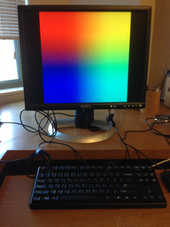
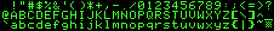
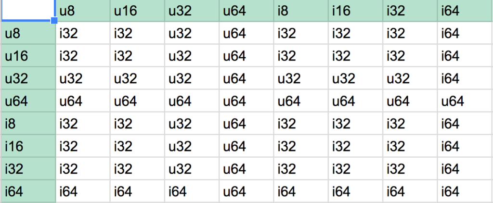

*Lab written by Philip Levis and Pat Hanrahan*

### Goals

The goal of the lab is understand everything you need for assignment 6.
In that assignment, you will be adding double-buffering
to the framebuffer initialization code, building a basic graphics
library, and creating a text console.

During this lab you will:

1. Connect your Raspberry Pi to a monitor and generate video
2. Read and understand the mailbox and fb code
3. Learn a bit more on pointers to multi-dimensional arrays
4. Read and understand fonts and the representation of characters

To complete the lab, you must complete the [check list](checklist) and 
show the results to the TA.

### Lab exercises

To start this lab, pull from `cs107e.github.io` and go into
the directory `_labs/lab6`. 

#### 1 Setup the Raspberry Pi to output video to a monitor (30 min)

You need an HDMI cable and an HDMI to DVI adapter, which we will
provide in lab.  Attach the HDMI to DVI adapter to one end of HDMI
cable.  Then attach the DVI connector to the monitor.  The monitors we
are using are older and do not have HDMI connectors.  Next, attach
the HDMI cable to the HDMI connector on the Raspberry Pi.  Power on
your Raspberry Pi, and you should see the following.

Now test the GPU on the Raspberry Pi.
Go into the directory `code/grid`.

     % make

Reset your Pi, and then type

     % make install

Once it reboots, you should see a grid on the monitor.

Modify the `grid.c` in two ways.

1. Change the video resolution to 1024 by 768, and redraw the grid.

2. Change the grid code to draw a checkerboard pattern (alternating
   black and white squares).

#### 2 Read and understand the fb and mailbox code (40 min)

##### The GPU mailbox

Recall from [lecture](/lectures/framebuffer/framebuffer.pdf) that the
CPU communicates with the GPU by sending it messages using a *mailbox*.
The mailbox contains a single message, stored as a pointer.
If the mailbox has a message,
it is full; if it has no message, it is empty. The communication
pattern we'll be using is that the CPU puts a message in the mailbox
for the GPU to read, and after processing the message the GPU responds
by putting another message in the mailbox for the CPU to read.

The CPU starts the exchange by creating a message and putting a
pointer to it in the mailbox. When this happens, the hardware alerts
the GPU, which reads the message, emptying the mailbox.  The GPU puts
a message in the mailbox, filling it again.  The CPU, in the
meanwhile, waits until the mailbox is full, and once it is full it
reads the reply message from the GPU.

##### Using the mailbox to configure the framebuffer

To configure the framebuffer, we use the mailbox to send a _framebuffer
configuration message_ to the GPU.

This message contains the physical
and virtual sizes of the framebuffer, as well as the depth of the
pixels. The physical size describes the size of the screen. The
virtual size describes the drawable area, which can be larger than
the physical size. The GPU's reply message includes a pointer to the
start of the framebuffer, the total size in bytes allocated to the
framebuffer, and the length of each scanline or row of the framebuffer
(this is called *pitch*).  Your code should check that the framebuffer
was configured properly by checking that the GPU's reply message has
the same physical and virtual sizes that you sent. Otherwise you might
have specified a size which the GPU doesn't support and your graphics
won't work properly.

If the framebuffer is configured properly, the GPU's reply message
will include a pointer to a *framebuffer*. This is a
contiguous block of memory that you can read and write to read and
write pixels.  The GPU continually refreshes the display based on
the contents of the framebuffer: if you change the framebuffer,
the display will be updated automatically. 

Change into the directory `code/fb`. That directory contains the files:

    % ls 
    Makefile    fb.c        memmap
    cstart.c    mailbox.c   start.s

The `fb.c` contains the function `fb_init()` that was shown in class. This
function configures the `fb_config_t` structure (the framebuffer configuration
message), and sends it to the GPU using `mailbox_write` and `mailbox_read`.
These mailbox functions are defined in `mailbox.c`.

Read and discuss the code in `fb.c` , `mailbox.h`, and `mailbox.c` with your lab
neighbors. Discuss each of these questions as a group, and have one person
in your group record your answers to each question on your checklist,
and then turn in the checklist to the CA at the end of the lab.

   1. Why does the code need each of the checks whether the mailbox is EMPTY
      or FULL? What might go wrong if the code didn't perform these checks?

   2. What happens if `fb_config_t fb` is not tagged as `volatile`?
      Generate and compare the
      assembly generated when it is volatile and when it is not.

   3. What happens if `mailbox_t mailbox` isn't tagged as volatile?
      Generate and compare the
      assembly generated when it is volatile and when it is not.

   4. Why can we add the `addr` and `channel` in `mailbox_write`?
      Could we also `|` them together?
      What bit positions are used for the `addr` and what for the `channel`?

   5. Who owns the addresses/memory where `fb`, `mailbox`, and the framebuffer itself sit,
      respectively? The CPU like any of our normal data structures? The GPU?
      Which of these can we move around, and which of these are given to us?
      Create a diagram of where these entities live and how they interact with each other;
      clearly mark where the CPU, GPU, and memory are.

   6. Suppose the code did not use GPU_NOCACHE -- what might go wrong?

#### 3 Multidimensional pointers (30 min)

Pointers are one of the hardest concepts in C.  The goal of this part
of the lab is to review basic pointer declarations, in particular,
pointers to multidimensional arrays. One convenient way to represent
images is with a multidimensional array. The framebuffer memory region
can be managed as a multidimensional array, which can be much easier
than explicitly calculating offsets into a one-dimensional array.

To start, here is a quick quiz.

* What is the difference between the following two lines of code?
  Think about what operations you can do to one versus the other.

        char *a = "Hello, world\n";
        char a[]= "Hello, world\n":

* Read the following code in
  `code/pointers/pointers.c`:

        int main(void) {
            int a[2][2] = { {0, 1}, {2, 3}};
            int  *b = &a[0][0];
            int (*c)[2] = a;
            int (*d)[2][2] = &a;

            printf("a = %08x\n", (unsigned)a );
            printf("&a[0][0] = %08x\n", (unsigned)(&a[0][0]) );
            printf("&a[0][1] = %08x\n", (unsigned)(&a[0][1]) );
            printf("b = %08x\n", (unsigned)b );
            printf("b+1 = %08x\n", (unsigned)(b+1) );
            printf("b+2 = %08x\n", (unsigned)(b+2) );
            printf("&a[0] = %08x\n", (unsigned)(&a[0]) );
            printf("&a[1] = %08x\n", (unsigned)(&a[1]) );
            printf("c = %08x\n", (unsigned)c );
            printf("c+1 = %08x\n", (unsigned)(c+1) );
            printf("d = %08x\n", (unsigned)d );
            printf("d+1 = %08x\n", (unsigned)(d+1) );

            int a1[] = { 0, 1 };
            int a2[] = { 2, 3, 4 };
            int *p[2] = { a1, a2 };
            int *q = p[0];

            printf("a1 = %08x\n", (unsigned)a1 );
            printf("a2 = %08x\n", (unsigned)a2 );
            printf("p = %08x\n", (unsigned)p );
            printf("q = %08x\n", (unsigned)q );
            printf("p[0] = %08x\n", (unsigned)p[0] );
            printf("p[1] = %08x\n", (unsigned)p[1] );
        }

   Compile this code using `make`.  This will generate an executable that
   runs on your laptop.  Run the code (`./pointers`) and interpret the results.

   Now uncomment the following code to the above example. What happens?

        int (*e)[2] = { {0, 1}, {2, 3}};
        printf("e = %08x\n", (unsigned)e );
        printf("e[0] = %08x\n", (unsigned)e[0] );
        printf("e[1] = %08x\n", (unsigned)e[1] );

   What is the difference between the following two declarations?

        int *p[2];

        int (*c)[2];

   You may find [this website](http://cdecl.org/) helpful in demystifying
   the meaning of various C declarations.

#### 4 Fonts (20 min)

A major part of your assignment will be to draw text on the screen.
In order to do this, you need a *font*.

This is a very famous font: can you identify what computer it's from?
In the provided font library, the characters are stored in a single
image that's a little different from the image above. The characters
are stored in a single line (not 3).  The first character stored on
the left is '!', whose ASCII value is 33 (0x21).  The last character
is '~' (tilde), whose ASCII value is 127 (0x7e). There are 95
characters in total. The characters are all the same size, 14 pixels wide
and 16 pixels tall.  This is
termed a *fixed-width* font. The character `' '` (space) is ASCII
value 32 (0x20) and is handled specially (since it draws nothing).

Take a look at the files `font.h` and `font.c` in `code/font`.

The file `font.c` contains the above image as a C struct.

    /* GIMP RGBA C-Source image dump */
    static const struct {
        unsigned int          width;
        unsigned int          height;
        unsigned int          bits_per_pixel;
        unsigned char         pixel_data[1330 * 16 / 8]; 
    } font = { 
      1330, 16, 1, 
      "\014\000\314\003\060\003\000\360\000\300\000\300\003\000\014\000"
      "\060\000\000\000\000\000\000\000\000\000\017\300\014\000\374\017"
      ...
      "\000\000\000\000",
    };

This format stores the characters as a bitmap: each pixel is either a
background or a foreground color. It stores them as a bitmap rather
than RGBA because it is much (32 times) smaller. This makes programs
much smaller and faster to upload to your Raspberry Pi. Each line of the image
is 1330 pixels (95 characters * 14 pixels wide), so 1330 bits. The
data of the image is represented in octal, where each number
represents 3 bits. A byte is written as three numbers: the first is
the two most significant bits, the second is bits 2-4, and the last is
bits 5-7.  So \014 is a single byte, whose bits are 00001100 (00 001
100). This is the first 8 bits of the top line of the exclamation
point: you can see it is two pixels wide.

* Quiz question (talk with your neighbor): why does pixel_data have size 1330 * 16 / 8?

The key function is `font_get_char()` which copies a single character
from the font image into a buffer. It transforms the bits into
pixels of the specified color. Read this function carefully,
since you will use it in the next assignment.

### Extension: Exploring Type Conversions

In this exploratory extension,
you will be inspecting various integer types within `gdb`.
This material was only partially covered in the lecture
on computer arithmetic. 
You may want to review the last slides from that lecture.

To start, `cd` into `code/types`.

Before we get started, here are the `gdb` commands you'll need to know:

* `ptype i8` prints the type of a variable
* `whatis i8 + u8` prints the resulting type of an expression
* `source i8.gdb` runs all the gdb commands in the named file
    * `source -v i8.gdb` ensures all commands, along with their results, are printed

Outside of `gdb`, you can type in either of the following commands
to run `gdb` commands from the get-go:

    $ arm-none-eabi-gdb -x start.gdb types.elf
    --OR--
    $ arm-none-eabi-gdb --command=start.gdb types.elf

Inspect each of the `*.gdb` files.
This shouldn't take too long,
so once you're done start up `gdb` with the above command.
Use `source` to run `gdb` commands for each of the integer types.
Remember that on the arm 32-bit architecture
a `char` is 8-bits,
a `short` is 16-bits,
an `int` (same as `long`) is 32-bits,
and a `long long` is 64-bits.

The type of the result of a binary operational
involving two types is summarized in the following table.
The headers show the two operand types,
and the cells show the resulting type.

Do these type conversions make sense?

* Why is the result of combining an `int16_t` and an `int8_t` an `int32_t`?

* Why is the result of combining an `int32_t` and an `int64_t` an `int64_t`?

* Why is the result of combining an `uint32_t` and an `int64_t` 
also an `int64_t`?

* Why is the result of a comparison operator like `<` or `==` an `int`?
For example, `whatis u8<u32` is an `int`.

* Any ideas why C defines the result of 
combining an `uint32_t` and an `int32_t` to be a `uint32_t`?

Now try this:

    (gdb) source -v uhoh.gdb

What in the world happened here?!

## Check off with TA

At the end of the lab period, submit the checkoff form to a TA 
so you are properly credited for your work.
