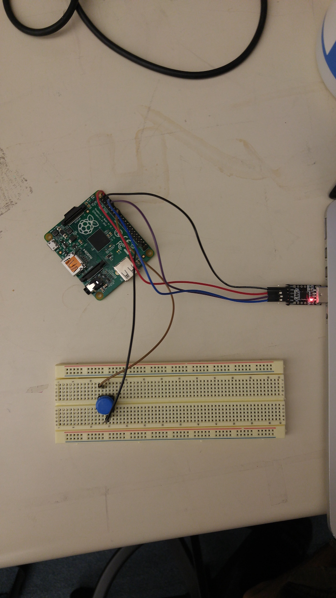

## Learning goals

During this lab you will:

1.  Go through how interrupts are set-up on the Pi.
2.  Enable GPIO event interrupts on your Pi.
3.  Display something on the screen when a button is pressed.
4.  Aggressively optimize a C function

We've provided several support libraries (GPIO implementations, timers,
interrupt initialization, etc.) to make this easier. Look at what's available
to you before getting started so you don't have to repeat work. The goal of the
lab is for you to get experience with enabling interrupts and having them
interact with your main loop. Please answer the questions as you work through
the lab, and check off with the TAs according to the [check list](checklist).

You will be using your Pi, a breadboard, and a two buttons in this lab.

## Lab exercises

To start this lab, `git pull` from `cs107e.github.io` and go into the directory
`_labs/lab7`.

### Interrupts

#### Compile the project and inspect its assembly (30 min)

Go to `code/interrupts`. We've provided you with several files to
build on, copied from the reference implementation of libpi.  With
your lab-mates, read through the code, starting with `start.s`, then
`cstart.c`, `vectors.s`, `lab7.c`, `register.s`, and
`interrupts.c`. Then, answer the questions below.
This code should be familiar from lecture.

1.  What assembly function (in `start.s`) does your Raspberry Pi boot into and
    what does it do?

2.  What function does this function call, and what does that function do?

3.  How does the starter code know how long the interrupt table is and safely
    copy it (and nothing more, nothing less) to 0x0?

4.  What is the name of the C function that the IRQ handler invokes? What file
    can this C function be found in?

#### Set Up a button circuit (15 min)

Set-up a simple, one button circuit such that the button's output
feeds into GPIO pin 21 (pin 40 on the Pi header).  What we want is for
the pin to default to being high (1). When we press the button, it
should go low (0).

The way to do this is to make the pin have a "pull-up resistor". (We
won't use a *physical* resistor; instead, we'll tell the Pi to set one
up for us.) This means that when the pin is in an open circuit (the
button is not pressed), it will default to a value of 1. When the
button is pressed, we want to close a circuit that connects the pin to
ground, so it will read a 0. This is like what the PS/2 keyboard does.

You should simply need to connect one side of the button to ground, and the
other side of the button to GPIO pin 21.

Next, implement the `button_test` function in `lab7.c`. The function
should start by setting GPIO pin 21 as an input and setting the
pull-up on the same pin. Look at your `keyboard.c` code for how to do
this.

Then spin in an infinite loop. On each iteration of the loop:

1. Wait until the pin is 0 (checking its state with
`gpio_read`). This waits for the button to be pressed down.

2. Once the button is pressed down, print a `"+"` using `printf` to
tell you.

3. Then wait until the pin is 1 again (that is, wait until you've
released the button).

Insert a call to `button_test` before the while loop in `main`.

Compile the program and run it on your Raspberry Pi. Ensure that
`button_test` works. Note that you'll likely get more than one "button
press" per physical button press. Why do you think this might be? When
you're done, answer the following questions.

1. Name two disadvantages, and one advantage, that the spin-loop implementation
   of detecting button presses has or would have over an interrupt based
   implementation.

2. Do you record (i.e., detect in code) one button press per physical button
   press? If not, why might this be?

#### Write an interrupt handler! (30 min)

Remove the call to `button_test` in `main`. Make sure you're still setting the
pin as input and setting the pullup resistor somewhere.

Before being able to handle interrupts, you'll need to configure your Pi so
that a falling edge on GPIO pin 21 will trigger an interrupt. We've already
written this code for you in `setup_interrupts`: you simply need to call it.
Ensure you understand what every line does and why it's necessary. 

Make a static counter named `cnt` in your `lab7.c`. How should you declare that
counter for the compiler? In the interrupt handler `int_handler`, increment the
counter `cnt`. In `main`, write an infinite loop that just displays the value of
`cnt` on each iteration using `printf`.

Compile and run your program. Ensure that it works as expected. That
is, that the counter increments ~once per button press and that the
counter is printed when it is incremented by the interrupt handler.

Now, comment out the `gpio_check_and_clear_event` call in `int_handler`.
Compile, run, and test this program by pressing the button. What happens? Why?
Take a look at `gpioevent.h`.

Uncomment the `gpio_check_and_clear_event` call. Compile and run your program,
and ensure that it works again. When you're done, go through the following questions.

1. Describe what every line of code in `setup_interrupts` does, even if it's
   commented out.

2. What happens if the interrupt event is not cleared before returning from the
   handler?

You are now ~60% through the lab! Keep going! 👏

#### Use circular buffer in interrupt handler. (10 min)

The Makefile links in the reference implementation of circular buffer code in
`libpi/modules/circular.o` so that you can use the `cir_enqueue` and `cir_dequeue` 
functions to push and pop from a circular buffer of integers. 
`libpi/include/circular.h` file declares these functions.

Instead of simply incrementing a counter in the interrupt handler, call
`cir_enqueue` with the counter's value. Then, in `main`, instead of reading the
counter directly, call `cir_dequeue` to get the last counter's value.
Read `circular.h` to understand how this function works.

Recompile and ensure that your code works exactly as before. When you're done,
answer the following:

1. Why might you want to enqueue/dequeue and then return instead of just doing
   arbitrary logic (like drawing on the screen) in the interrupt handler?

#### Add a separate button and display interrupts. (15 min)

Make 2 copies of your test circuit with 2 different buttons. Hook them up to 2
different GPIO pins. Configure your Pi so it has an interrupt on either a
falling or rising edge of either pin -- that is, whenever the state of a button
changes.

In the interrupt handler, clear any pending events and handle the event from
each button if `gpio_check_and_clear_event` returns 1 for that pin. Now maintain
a separate counter for each button. For each time a button is pressed or
released, increase its counter by 1.

If you use two circular queues, be careful: don't forget that `cir_dequeue`
blocks until there's something available on that queue. Why would this be a
problem if, in your main loop, you called `cir_dequeue` on one queue, then
`cir_dequeue` on the other queue?

Display the counters on your screen in your main loop. When you're done, we
have a few questions for you!

1. By how much does a counter increment on a button press or
release?  Does this number seem higher or lower than the actual number
of times you pressed buttons?

2. Why does releasing the buttons cause your counters to
   increase? Suggest a reason why it might not match up with how many times
   you press or release the buttons.

### Optimization (20 min)

Change directory to `code/speed` and review the source in the `speed.c`
file.

The program implements `strcpy`, the function to copy a string from
the standard C library, along with some timer scaffolding to count the
ticks during the function's execution. You can learn more about this
and other library functions by typing in `strcpy` into your terminal.

The given version works correctly, but is naive to a fault. Build the
code as given, install it to the Pi, and run it to get a baseline tick
count. It is possible to gain more than a 1000x speedup over the
starter version!

Take a stepwise approach, so you can measure the effect of a given
modification in isolation.  Copy the starter function into a new
version and make a single change.  Make a rough prediction about the
expected gain from that change. Now run and time the new version to
see whether your intuition matches the observed reality. Where the
results surprise you, examine the generated assembly to see if you can
figure out why there is a different effect than you expected. Repeat
this process, each time advancing from the best version so far and
making another small change.

Below are some suggested avenues to explore:

+ As the first improvement, that call to `strlen` inside the loop has gotta go!
Hoist it out to earn a shockingly large gain. It's not the function call
overhead that is so high (i.e. inlining `strlen` would not help much if at all),
this is actually a big-O problem: recalculating the string length each
iteration makes the copy function run in quadratic time instead of linear--
ouch! Most optimzation focuses on reducing the constant factors for an algorithm
with a given big-O, but if you can restructure into a better big-Oh, that is
generally a much bigger win.

+ Edit the Makefile to enable various levels of compiler optimization and
rebuild and re-run. What difference do you observe between `-O0`, `-Og`, `-O2` and
`-Ofast`? Pick the best setting and let's see how much you can add to what gcc can
do.

+ The two string traversals (once to get length, again to copy) can be unified
into one traversal that stops after copying the null char. What improvement
would you expect from this change? Try it out and see what difference it makes.

+ Will replacing array subscripts with pointer arithmetic help, e.g. `src[i]`
into `*(src + i)`? What about walking a pointer down the string rather than
accessing each char relative to start?  Try these changes out. What gain do you
see?

+ Copying chunk of more than one byte has to be a win, right? Rewrite the loop
to copy in chunks of size word rather than a single byte. The chunking gets a
little tricky as string length might not be multiple of the chunk size, creating
leftover to process at end. More critically, when iterating by word, the loop
still has to examine each byte in the current word to check for presence of a
null terminator, even though the whole goal was to avoid single-bytes and
consolidate into chunks! Read [this
page](http://bits.stephan-brumme.com/null.html) to learn of a clever way to
efficiently find a null byte within a word. Talk to your lab partner to
understand how the bitwise approach works.  Now try out the code and see how it
fares.  (Note: last iteration by word might  read beyond proper end of string's
memory -- is this read guaranteed to be safe? always dangerous? Why or why not?)

+ Try hand-unrolling the loop two or four times to better amortize loop
overhead. ([This is what we mean by unrolling.](https://en.wikipedia.org/wiki/Loop_unrolling#A_simple_manual_example_in_C)) What gain do you see?

How big of an improvement were you able to make overall?

## TA Check Off

At the end of the lab period, submit the checklist and ask your lab TA to
approve your submission so you are properly credited for your work. To speed up
the checkout process, the questions found on the checklist will be a strict subset
of the questions we ask you in lab. It is still in the best interest of your
educational experience to answer as many of the questions as you can!
